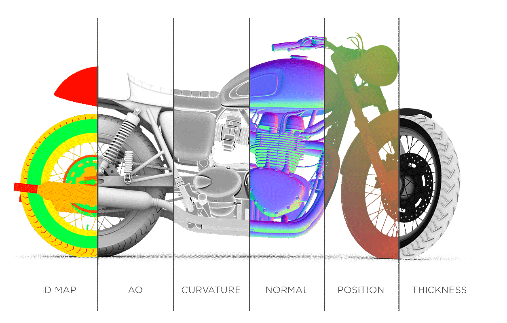

# Substance Bakers

<table>
<tr style="border: 0;">
<td width="41.60%" style="border: 0;" valign="top">

Les <b></b> sont un ensemble d&#39;outils d&#39;algorithme avancé pour calculer les informations basées sur les maillages dans des fichiers de texture. Ils peuvent être utilisés par n&#39;importe quel artiste avec un maillage 3D pour tirer parti des méthodes de texture avancées. La cuisson est un processus au cœur du workflow logiciel Substance afin d&#39;offrir<b> des outils puissants</b> et <b>texturation automatisée</b>.

Cette documentation couvre les <b>principes fondamentaux de la cuisson</b> ainsi que les <b>problèmes courants</b> et les erreurs qui peuvent se produire lors de ce processus.

</td>
<td width="58.30%" style="border: 0;" valign="top">

{width="400px"}

</td>
</tr>
</table>

<table>
<tr style="border: 0;">
<td style="border: 0;" valign="top">

## Prise en main

* [Qu&#39;est-ce que la cuisson ?](../getting-started/what-is-baking/what-is-baking.md)
* Cuire au four avec :
  * [Substance 3D Painter](../getting-started/software-interface/3d-painter/substance-3d-painter.md)
  * [Substance 3D Designer](../getting-started/software-interface/3d-designer/substance-3d-designer.md)
  * [Substance 3D Automation Toolkit](../getting-started/software-interface/3d-automation-toolkit/substance-3d-automation-toolkit.md)
* [Disponibilité par logiciel](../getting-started/availability-per-software/availability-per-software.md)
* [Logiciels 3D compatibles](../getting-started/compatible-3d-software/compatible-3d-software.md)
* [Tutoriels](../getting-started/tutorials/tutorials.md)

</td>
<td style="border: 0;" valign="top">

### Bakers Settings

* [Paramètres communs](../bakers-settings/common-parameters/common-parameters.md)
* [Occlusion ambiante](../bakers-settings/ambient-occlusion/ambient-occlusion.md)
* [Occlusion ambiante du maillage](../bakers-settings/ambient-occlusion-from/ambient-occlusion-from-mesh.md)
* [Normales courbées du maillage](../bakers-settings/bent-normals-from-mesh/bent-normals-from-mesh.md)
* [Map color à partir du maillage](../bakers-settings/color-map-from-mesh/color-map-from-mesh.md)
* [Convertir UV en SVG](../bakers-settings/convert-uv-to-svg/convert-uv-to-svg.md)
* [Courbure](../bakers-settings/curvature/curvature.md)
* [Courbure du maillage](../bakers-settings/curvature-from-mesh/curvature-from-mesh.md)
* [Courbure du maillage (obsolète)](../bakers-settings/curvature-from-mesh-dep/curvature-from-mesh-deprecated.md)
* [Map height depuis le maillage](../bakers-settings/height-map-from-mesh/height-map-from-mesh.md)
* [Map normal depuis le maillage](../bakers-settings/normal-map-from-mesh/normal-map-from-mesh.md)
* [Masque d&#39;opacité à partir du maillage](../bakers-settings/opacity-mask-from-mesh/opacity-mask-from-mesh.md)
* [Position](../bakers-settings/position/position.md)
* [Carte de position à partir du maillage](../bakers-settings/position-map-from-mesh/position-map-from-mesh.md)
* [Map thickness depuis le maillage](../bakers-settings/thickness-map-from-mesh/thickness-map-from-mesh.md)
* [Texture transférée à partir du maillage](../bakers-settings/transferred-texture-from/transferred-texture-from-mesh.md)
* [Direction dans l&#39;espace monde](../bakers-settings/world-space-direction/world-space-direction.md)
* [Normales de l&#39;espace monde](../bakers-settings/world-space-normals/world-space-normals.md)

</td>
<td style="border: 0;" valign="top">

### Guides

* [Messages d’erreur et d’avertissement](../guides/error-and-warning-mes/error-and-warning-messages.md)
* [Performances et optimisations](../guides/performances-and-opt/performances-and-optimizations.md)
* [Triangulation avant cuisson](../guides/triangulating-before-bak/triangulating-before-baking.md)

</td>
</tr>
</table>

<table>
<tr style="border: 0;">
<td style="border: 0;" valign="top">

### Fonctionnalités

* [Cache de géométrie](../features/geometry-cache/geometry-cache.md)
* [Raytracing GPU](../features/gpu-raytracing/gpu-raytracing.md)
* [Correspondance par nom](../features/matching-by-name/matching-by-name.md)
* [Repère tangent](../features/tangent-space/tangent-space.md)

</td>
<td style="border: 0;" valign="top">

### Questions courantes

* [Comment exporter les cartes cuites ?](../common-questions/how-export-the-baked-maps/how-to-export-the-baked-maps.md)
* [Le tramage est-il appliqué aux textures cuites au four ?](../common-questions/dithering-applied-baked/is-dithering-applied-to-baked-textures.md)
* [Dois-je activer « Calculer l’espace tangent par fragment » ?](../common-questions/should-enable-compute-tan/should-i-enable-compute-tangent-space-per-fragment.md)
* [La texture cuite en dehors du logiciel Substance semble incorrecte](../common-questions/texture-baked-outside-sof/texture-baked-outside-of-substance-software-looks-incorrect.md)
* [Que sont les fichiers Assin ?](../common-questions/what-are-assbin-files/what-are-assbin-files.md)
* [Quelle est la profondeur des textures cuites au four ?](../common-questions/what-the-bit-depth-baked/what-is-the-bit-depth-of-baked-textures.md)
* [Quelle est la différence entre le format normal OpenGL et DirectX ?](../common-questions/what-the-difference-bet/what-is-the-difference-between-the-opengl-and-directx-normal-format.md)
* [Pourquoi y a-t-il des étirements étranges dans mes textures après la cuisson ou l&#39;exportation ?](../common-questions/why-are-there-strange-str/why-are-there-strange-stretches-in-my-textures-after-baking-or-exporting.md)
* [Pourquoi la correspondance par nom ne fonctionne-t-elle pas avec l’occlusion/épaisseur ambiante ?](../common-questions/why-matching-name-not-wor/why-is-matching-by-name-not-working-with-ambient-occlusion-thickness.md)
* [Pourquoi mon maillage est-il complètement noir après cuisson ?](../common-questions/why-mesh-fully-black-aft/why-is-my-mesh-fully-black-after-baking.md)

</td>
<td style="border: 0;" valign="top">

### Problèmes courants

* [Aliasage sur coutures UV](../common-issues/aliasing-on-uv-seams/aliasing-on-uv-seams.md)
* [La sortie Baker est entièrement noire ou vide](https://helpx.adobe.com/substance-3d/unlisted/documentation/bake/baker-output-is-fully-black-159451835.html)
* [Échec du cuisson avec Color Map de Mesh](../common-issues/baking-failed-with-color/baking-failed-with-color-map-from-mesh.md)
* [Les ombres noires sont visibles sur la surface du maillage](../common-issues/black-shading-cross-are/black-shading-cross-are-visible-on-the-mesh-surface.md)
* [Les parties du maillage se fondent les unes dans les autres](../common-issues/mesh-parts-bleed-between/mesh-parts-bleed-between-each-other.md)
* [La carte normale a d&#39;étranges dégradés colorés](../common-issues/normal-map-has-strange/normal-map-has-strange-colorful-gradients.md)
* [La texture normale a l&#39;air facettisée](../common-issues/normal-texture-looks-fac/normal-texture-looks-faceted.md)
* [Les coutures sont visibles après cuisson d&#39;une texture normale](../common-issues/seams-are-visible-after/seams-are-visible-after-baking-a-normal-texture.md)
* [Couture visible sur chaque face](../common-issues/seam-visible-every-face/seam-visible-on-every-face.md)

</td>
</tr>
</table>
