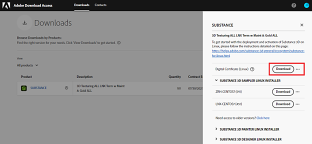
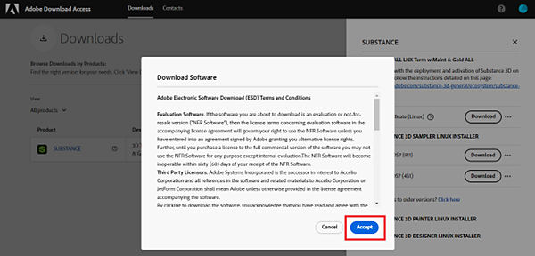

# Guide de déploiement

Après avoir acheté Substance 3D pour Linux® via votre contrat d&#39;entreprise, les produits et licences correspondants sont fournis sur le portail [Accès au téléchargement Adobe (ADA)](https://download-access.adobe.com/lws/downloads). Vous devrez télécharger à la fois les versions logicielles et les fichiers de clé de licence d’ADA pour déployer le logiciel avec succès.

## Téléchargez les versions logicielles et les fichiers de clés de licence :

Connectez-vous pour [Adobe de l&#39;accès au téléchargement](https://download-access.adobe.com/lws/downloads). Recherchez les versions logicielles et les fichiers de clés de licence :

1. Utilisez la liste déroulante Compte pour sélectionner le compte sur lequel vous avez acheté Substance 3D Linux.

   
1. Accédez à Téléchargements avec le lien dans l’en-tête de page.

   
1. Cliquez sur Afficher les téléchargements pour le produit correspondant.

   
1. ADA chargera les informations de licence associées à cet ID et les affichera dans le tableau ci-dessous.
1. Cliquez sur « Télécharger » sur la ligne « Certificat numérique » pour télécharger le fichier zip contenant les fichiers de clé de licence.

   * Le fichier zip contient une clé de licence par produit.
   * La clé de licence activera le produit sur chacun de vos ordinateurs sous licence.

   
1. Cliquez sur « Substance 3D », Sampler, Painter ou Designer pour afficher les versions logicielles de Substance 3D Painter, Substance 3D Designer et Substance 3D Sampler.
1. Cliquez sur « Télécharger » pour télécharger le fichier d’installation du produit que vous souhaitez installer.

   
1. Une notification « Télécharger le logiciel » s’affiche. Cliquez sur « accepter ».

   

## Installation et activation

Pour installer le logiciel :

1. Double-cliquez sur le fichier EXE du produit pour lancer l’assistant d’installation.
1. Suivez les étapes d’installation pour terminer l’installation.

Il existe deux options pour l’activation du logiciel : l’activation locale ou l’activation réseau.

### Activation locale

1. Décompressez le dossier zip téléchargé depuis ADA.
1. Lancez le logiciel à activer.
1. Dans l’assistant d’activation, sélectionnez Activer à l’aide d’un fichier de clé de licence.

   
1. Cliquez sur « Parcourir » et pointez sur l’emplacement du fichier de clé de licence correspondant.
1. Cliquez sur « Suivant » pour activer le logiciel.

### Activation réseau

1. Décompressez le dossier zip téléchargé depuis ADA.
1. Placez les fichiers de clé de licence décompressés sur un réseau monté partagé.
1. Sur l’ordinateur de l’utilisateur, configurez une variable d’environnement pointant vers le fichier de clé de licence, comme expliqué sur ces pages :

   * Substance 3D Painter - <https://experienceleague.adobe.com/en/docs/substance-3d-painter/using/pipeline-and-integration/configuration/environment-variables>
   * Substance 3D Designer - <https://experienceleague.adobe.com/en/docs/substance-3d-designer/using/pipeline-and-project-configuration/environment-variables>
   * Substance 3D Sampler - <https://experienceleague.adobe.com/en/docs/substance-3d-sampler/using/pipeline-and-integrations/environment-variables>
