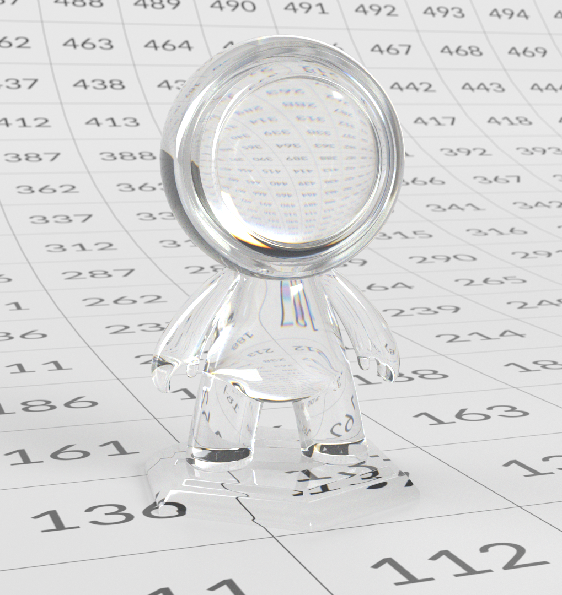

# OpenPBR

[**Téléchargez une version hors ligne de cette page.**](../assets/openpbrf/openpbr.pdf)

**OpenPBR** est un ombrage de surface physique libre conçu pour fournir une description cohérente et prévisible des matériaux dans différents outils 3D, systèmes de rendu et pipelines. Il définit un modèle de matériau unique et complet capable de représenter une large gamme de surfaces réelles, tout en restant suffisamment flexible pour prendre en charge des aspects plus stylisés ou axés sur l’artiste à l’aide de paramètres physiquement significatifs.

Le modèle corrige des incohérences de longue date entre les shaders « standard » qui se comportent de manière similaire dans le nom, mais diffèrent dans les définitions de paramètres et les hypothèses physiques entre les applications. Fondé sur les principes du rendu physique, l’OpenPBR décrit les matériaux en termes de comportement lumineux réel, en mettant l’accent sur la conservation de l’énergie, les plages de paramètres intuitives et les réponses d’éclairage stables. Plutôt que de prescrire une interface utilisateur spécifique, OpenPBR définit le comportement des matériaux à un niveau fondamental, ce qui permet aux outils de mettre en œuvre le modèle à leur manière tout en préservant la cohérence des résultats visuels lorsque les actifs se déplacent entre les applications et les pipelines.

Ce document est un guide axé sur les artistes pour comprendre et travailler avec l’OpenPBR. Il explique les principes sous-jacents du modèle, comment ses composants décrivent le comportement de la lumière dans le monde réel et comment ces idées se traduisent en création matérielle pratique. Plutôt que de se concentrer sur une application spécifique, le guide est destiné aux artistes 3D travaillant dans des domaines tels que le développement de l’aspect, la texturation et le rendu, qui souhaitent créer des matériaux robustes et physiquement plausibles qui restent cohérents et transférables dans différents environnements logiciels.

>[!NOTE]
>
> Si vous travaillez déjà avec OpenPBR et que vous recherchez une assistance technique, [la FAQ sur l&#39;OpenPBR](openpbr-faq.md) peut déjà avoir des réponses à vos questions.

*La scène de démonstration OpenPBR ci-dessus a été créée par Nikie Monteleone. Des exemples de rendus de matériau et de canal dans ce document ont été créés par Celine Dameron.*

## Interopérabilité et normes de fichiers

### Un langage matériel partagé avec l&#39;OpenPBR

L’un des principaux objectifs de l’OpenPBR est d’améliorer la façon dont les matériaux se déplacent entre les outils. Plutôt que d&#39;être un nuanceur lié à un seul moteur de rendu ou à une seule application, OpenPBR définit un **modèle d&#39;ombrage partagé** : une façon courante de décrire comment un matériau répond à la lumière.

Pour les artistes, cela signifie qu&#39;un matériau OpenPBR n&#39;est pas seulement, par exemple, un « matériau Adobe » ou un « matériau Autodesk », mais plutôt une description du comportement en surface et en volume qui peut, en principe, être comprise par plusieurs outils. L’objectif est qu’un document créé dans une application puisse être interprété de manière cohérente dans d’autres applications, à condition que ces outils prennent en charge le modèle OpenPBR.

### Problème d’échange d’actifs

Les spécifications de l&#39;OpenPBR reconnaissent explicitement un défi de longue date en matière de production : **les matériaux ne voyagent pas bien entre les applications**. Les différents moteurs de rendu utilisent souvent des noms de paramètres, des hypothèses d’ombrage et des modèles sous-jacents différents, ce qui rend la correspondance d’apparence difficile et chronophage.

L&#39;OpenPBR est une réponse à ce problème. En définissant un seul modèle de matériau mis à la terre qui couvre les besoins de production communs - métaux, diélectriques, matériaux en couches, transmission, diffusion - il fournit une cible stable pour les échanges. Bien que cela ne garantisse pas des correspondances visuelles parfaites dans toutes les situations, cela réduit considérablement l&#39;ambiguïté par rapport aux modèles de shader propriétaires.

Pour les artistes, l&#39;essentiel est que l&#39;OpenPBR vise à préserver *l&#39;intention*. Même lorsque la parité visuelle exacte n&#39;est pas possible, la structure du matériau - ce qui est métallique, ce qui est transmissif, à quel point une surface est rugueuse ou anisotrope - reste claire et transférable.

### Relation avec la matière X

OpenPBR est étroitement lié à **MaterialX**, une structure de référence pour la description des matériaux et l’aspect indépendamment du rendu. La mise en œuvre de référence d&#39;OpenPBR vit dans MaterialX, ce qui signifie que les matériaux OpenPBR peuvent être représentés en utilisant un format d&#39;échange établi déjà pris en charge sur de nombreux pipelines.

Cette relation est importante, car l&#39;OpenPBR lui-même n&#39;est **pas un format de fichier**. Au lieu de cela, il définit *ce* qu&#39;est un matériau, tandis que MaterialX fournit un moyen standardisé de *stocker et d&#39;exchange* de ce matériau entre les outils. En pratique, cela permet d’incorporer des matériaux d’OpenPBR dans des descriptions de scène plus larges et de les partager entre les DCC et les systèmes de rendu prenant en charge MaterialX.

Pour les artistes, cela se passe généralement sous le capot - mais cela explique pourquoi les matériaux OpenPBR sont de plus en plus décrits comme « portables » ou « interopérables » dans les pipelines modernes.

### Ce que signifie l&#39;interopérabilité et ce qu&#39;elle ne signifie pas

Il est important d&#39;établir des attentes réalistes en matière d&#39;interopérabilité. L&#39;OpenPBR ne promet pas qu&#39;un matériau sera identique dans chaque application. Les différences d’éclairage, d’algorithmes de rendu, de gestion des couleurs et de prise en charge des fonctionnalités peuvent toujours affecter l’image finale.

L&#39;OpenPBR fournit une base commune : un ensemble cohérent de paramètres et de comportements, une compréhension commune de la façon dont les matériaux sont construits et un chemin plus clair pour transférer des matériaux entre les outils sans les reconstruire à partir de zéro.

Pour les artistes, cela signifie moins de surprises lorsque les ressources passent d’un service ou d’une application à l’autre, et un workflow qui met l’accent sur une logique matérielle durable plutôt que sur des astuces spécifiques à un outil.

### Implications pratiques pour les artistes

Au quotidien, travailler avec des OpenPBR encourage des habitudes qui favorisent naturellement l&#39;interopérabilité :

* Penser en termes de comportement de la lumière plutôt que de types de matériaux spécifiques à l&#39;application
* Utilisation de paramètres physiquement significatifs (métallisme, rugosité, transmission, diffusion)
* Éviter de recourir à des solutions non documentées ou spécifiques au rendu

Même lorsque les matériaux ne quittent jamais une seule application, ces pratiques s’alignent sur les normes de pipeline modernes, ce qui rend les actifs plus pérennes à mesure que les outils et les systèmes de rendu évoluent.

## Types de matériaux

### Matériaux définis par interaction avec la lumière

L&#39;OpenPBR est un modèle monolithique (un «uber-shader») destiné à représenter une large gamme de types de matériaux ; ces types sont décrits en termes d&#39;interaction de la lumière avec eux. Plutôt que de définir des matériaux en termes de préréglages fixes tels que, par exemple, le «verre» ou la «peau», chaque matériau OpenPBR est construit à partir d&#39;un modèle de couches horizontales et verticales, ce qui permet aux artistes de mélanger des caractéristiques entièrement définies et physiquement significatives - telles que la réflexion diffuse, la réflexion du specular, la transmission, la diffusion sous la surface et la superposition. Différentes combinaisons de ces comportements produisent naturellement des matériaux familiers du monde réel.

<table>
  <tr style="border: 0;">
    <td style="border: 0;" valign="top"></td>
    <td style="border: 0;" valign="top"></td>
    <td style="border: 0;" valign="top"></td>
  </tr>
</table>

Cette approche utilise un modèle fixe qui définit à l&#39;avance le cadre de la superposition et du mélange, contournant ainsi toute exigence pour l&#39;artiste de créer un réseau d&#39;ombrage au cas par cas, et permet à l&#39;OpenPBR de représenter des matériaux simples et complexes d&#39;une manière cohérente et physiquement ancrée.

 Cliquez pour zoomer. *Figure adaptée de la spécification OpenPBR Surface, © Academy Software Foundation, utilisée sous la licence Apache 2.0*

### Comportements des matériaux de base

Bien que l&#39;OpenPBR n&#39;impose pas de types de matériaux stricts, la plupart des matériaux du monde réel se répartissent en quelques grandes catégories de comportement. Comprendre ces catégories peut aider à établir un modèle mental solide pour les matériaux de construction.

### Matériaux diélectriques (non métalliques)

<table>
  <tr style="border: 0;">
    <td style="border: 0;" valign="top"> <em>Exemple de matériau diélectrique.</em></td>
    <td style="border: 0;" valign="top">Les diélectriques sont des matériaux non métalliques tels que le plastique, le bois, la pierre, le tissu, le caoutchouc et la peau. Leurs caractéristiques principales sont les suivantes :  <ul><li>Composante de diffusion visible</li><li>Principalement des reflets de specular incolores (blancs)</li><li>Réflectivité contrôlée principalement par l’indice de réfraction (IOR)</li><li>Aucun comportement de réflexion métallique</li></ul>  <strong>Paramètres clés pour les matériaux diélectriques :</strong>  <ul><li>La couleur de base définit la couleur globale du matériau</li><li>La couleur du specular influence la teinte des hautes lumières du specular (surtout sous un angle rasant)</li><li>Le paramètre Rugosité du specular contrôle la netteté des tons clairs du specular</li><li>Specular Poids redimensionne l’intensité globale des hautes lumières de specular </li><li>Pour les matériaux diélectriques, la réflexion diffuse domine l’aspect de la surface et est contrôlée par la couleur de base. Les reflets au specular sont limités à l'incidence normale et augmentent vers les angles de pâturage, mais restent non teintés.</li></ul></td>
  </tr>
</table>

### Matériaux métalliques

<table>
  <tr style="border: 0;">
    <td style="border: 0;" valign="top"> <em>Un example de matériau métallique.</em></td>
    <td style="border: 0;" valign="top">Les matériaux métalliques tels que l'acier, l'aluminium, le cuivre ou l'or se comportent fondamentalement différemment des matériaux non métalliques (diélectriques). Pour les métaux, l’aspect est presque entièrement déterminé par la réflexion du specular : contrairement aux diélectriques, les métaux n’ont pas de composante diffuse et la lumière ne dispersion pas sous la surface, mais est réfléchie directement. Leurs caractéristiques principales sont les suivantes :  <ul><li>Aucune composante diffuse : la couleur provient entièrement de la réflexion</li><li>Reflets de specular colorés</li><li>Les détails de la surface, en particulier la rugosité, jouent un rôle majeur dans l’apparence</li></ul>  <strong>Paramètres clés pour les matériaux métalliques :</strong>  <ul><li>Couleur de base contrôle la couleur des reflets</li><li>Le paramètre Rugosité du specular contrôle la netteté ou le flou de ces reflets</li><li>Specular Intensité de réflexion des échelles de poids</li></ul></td>
  </tr>
</table>

### Métallique de base

Le paramètre Métal de base définit si un matériau se comporte comme un diélectrique ou un métal. Il ne s’agit pas simplement d’un ajustement visuel, mais d’une modification de la réponse lumineuse sous-jacente du matériau.

* **0** → entièrement non métallique (diffusion + specular)
* **1** → entièrement métallique (specular uniquement)
* **0-1** → un mélange des deux comportements. Les valeurs intermédiaires sont mieux utilisées pour les mélanges de matériaux tels que le dirt, la corrosion ou les surfaces usées, plutôt que pour les matériaux « partiellement métalliques ».

#### Conseils pratiques pour la métallurgie

* Utiliser **0** ou **1** pour la plupart des matériaux
* Utiliser les valeurs moyennes uniquement pour les surfaces mixtes
* Utilisez la rugosité et les détails de la surface pour façonner l’aspect métallique.

Utilisez des couches (par exemple, Coat) au lieu de réduire la métallisation pour les métaux peints ou revêtus, les matériaux transparents et transmissifs.

### Matériaux transparents et transmissifs

Les matériaux transparents et transmissifs laissent passer la lumière. Des exemples courants comprennent le verre, de nombreux liquides et les plastiques transparents ou teintés. Leurs caractéristiques principales sont les suivantes :

* La lumière entre dans la surface et sort du côté opposé
* Le thickness affecte fortement l’aspect
* Réfraction contrôlée par l’indice de réfraction (IOR) et affectée par la rugosité de la surface
* Réfraction, absorption, diffusion et dispersion façonnent l’aspect final

La transmission décrit la manière dont la lumière traverse un objet. Les zones plus épaisses apparaissent plus sombres ou plus saturées, tandis que les zones plus fines apparaissent plus claires. Des paramètres tels que Couleur de transmission, Profondeur de transmission, Couleur de Dispersion et Dispersion fonctionnent ensemble pour contrôler ce comportement.

Une distinction entre les termes « transparent » et « transmissif » : « transparent » est un terme de la vie réelle, de tous les jours ; quelque chose est transparent si nous pouvons le voir à travers. « Transmissif » est synonyme de « translucidité ». Le verre givré, par exemple, permet à la lumière de le traverser (et donc, il est transmetteur), mais il n&#39;est pas transparent - nous ne pouvons pas le voir à travers.

### Matériaux souterrains

<table>
  <tr style="border: 0;">
    <td style="border: 0;" valign="top"> <em>Exemple de matériau utilisant la diffusion de surface.</em></td>
    <td style="border: 0;" valign="top">Les matériaux souterrains permettent à la lumière d'entrer dans la surface, de dispersion sous celle-ci et de sortir à nouveau près du point d'entrée. Les exemples courants comprennent la peau, la cire, le marbre et de nombreux matériaux organiques, tels que de nombreux types d'aliments. - les fruits, les légumes ou le fromage Saint-Nectaire, par exemple. Les caractéristiques déterminantes des matériaux souterrains sont les suivantes :   <ul><li>Ombrage souple et diffus</li><li>Débordement de couleur dans les zones minces</li><li>L’aspect dépend du thickness</li><li>La lumière ne traverse pas l’objet</li></ul>   La diffusion souterraine est distincte de la transmission. Alors que la transmission décrit la lumière traversant un matériau et sortant du côté opposé, la diffusion sous-superficielle décrit la lumière entrant dans une surface, diffusant à l'intérieur de cette surface, puis sortant au voisinage du point par lequel elle est entrée, principalement du même côté. Notamment, les matériaux métalliques ne supportent pas la transmission ou la diffusion sous la surface. La modification de la valeur de transmission ou de sous-surface d'un matériau entièrement métallique (c'est-à-dire un matériau dont la valeur de métallisation de base est 1) n'affectera pas son apparence.</td>
  </tr>
</table>

## Fusion entre les comportements de matière

Les matériaux du monde réel sont rarement parfaitement purs. De nombreuses surfaces sont mieux décrites comme des mélanges de comportements, plutôt que comme appartenant à une seule catégorie. Par exemple, si une surface présente des signes de dirt, d’usure ou de rouille, différentes parties de la surface réagiront à la lumière de différentes manières. L&#39;OpenPBR permet de le faire en permettant un mélange régulier, d&#39;une partie d&#39;une surface à une autre.

### Le métal comme mélange

<table>
  <tr style="border: 0;">
    <td style="border: 0;" valign="top"> <em>Dans ce matériau, le fer a une métallisation de 1, tandis que la rouille a une métallisation de 0. Il peut y avoir des valeurs intermédiaires de métallisation où la rouille passe au fer.</em></td>
    <td style="border: 0;" valign="top">Bien que la métallisation soit généralement définie sur 0 ou 1 (c’est-à-dire entièrement non métallique ou entièrement métallique), les valeurs intermédiaires sont significatives. Ces valeurs représentent des surfaces où des matériaux métalliques et non métalliques sont mélangés à petite échelle, dans des cas tels que des peintures contenant des particules ou des flocons métalliques. En outre, comme mentionné précédemment, les matériaux OpenPBR sont construits à partir de couches qui représentent des interfaces physiques distinctes. Il est tout à fait possible que la couche de base d'un matériau (sa couche «cœur») soit métallique, mais qu'elle ait une couche Coat non métallique au-dessus - la couche Coat n'est pas simplement un contrôle supplémentaire du specular - elle représente une surface physique séparée à travers laquelle la lumière doit passer. Ce serait le cas de certains types de peinture automobile, par exemple : les flocons métalliques seraient représentés dans la couche de base du matériau, tandis que la couche de revêtement représenterait une laque transparente.</td>
  </tr>
</table>

### Association de calques pour créer un comportement complexe

Des matériaux complexes, tels que le verre dépoli ou la peinture de voiture mentionnés précédemment dans cette section, sont créés en combinant plusieurs comportements de manière contrôlée. Par exemple :

* **Verre givré** : transmission combinée à une rugosité et une diffusion élevées
* **Métal peint** : une surface diélectrique sur une base métallique, souvent avec une couche claire. Plutôt que de réfléchir en termes de paramètres prédéfinis, il est plus efficace de considérer quels comportements physiques sont présents et comment ils interagissent. Les matériaux OpenPBR sont définis par des composants physiquement significatifs qui décrivent la façon dont la lumière interagit avec les surfaces. Les «types» de matériaux émergent naturellement de combinaisons de comportements, plutôt que d&#39;être sélectionnés explicitement. En se concentrant sur l’interaction, le mélange et la superposition de lumières, les artistes peuvent créer une large gamme de matériaux réalistes tout en conservant leur plausibilité physique.

## Utilisation d’OpenPBR

### L&#39;architecture conceptuelle d&#39;un matériau OpenPBR

OpenPBR est conçu comme un modèle d&#39;ombrage de surface unique et unifié capable de représenter une large gamme de matériaux réels. Plutôt que de basculer entre différents shaders pour différents types de matériaux, OpenPBR combine plusieurs caractéristiques de surface dans une architecture en couches.

Conceptuellement, on peut considérer qu&#39;un matériau OpenPBR possède trois éléments essentiels :

* **Un framework fondamental** : OpenPBR considère qu&#39;un matériau est constitué de composantes physiques qui peuvent être fusionnées (mélange horizontal) ou empilées les unes sur les autres (superposition verticale). Ces blocs peuvent réagir différemment à la lumière. Lorsque deux de ces blocs sont fusionnés, le résultat sera un mélange de la réflexion des deux. Cependant, lorsqu’ils sont superposés, le bloc le plus bas ne reçoit et ne réfléchit que la lumière que laisse passer le bloc le plus haut. Cette configuration permet aux artistes de considérer le matériau comme un mélange de composants plus simples. La définition de ces éléments et de leur emplacement constitue le deuxième élément clé :
* **Une série de calques qui contribuent au framework partagé** : chaque matériau possède un calque de base qui détermine les caractéristiques telles que la couleur principale du matériau ou si le matériau est rugueux ou lisse. Les matériaux peuvent également avoir des couches supplémentaires (film mince, couche et flou) qui peuvent reproduire des effets tels que le vernis ou le dust.
* **Un ensemble de commandes orientées vers l’artiste** : une interface permettant à l’artiste de contrôler les règles du cadre de réflexion, et donc l’apparence de l’OpenPBR dans son ensemble. Selon la façon dont un logiciel spécifique peut représenter ces commandes dans son interface utilisateur, il s’agit essentiellement d’un ensemble de boutons ou de curseurs qui permettent à un artiste de contrôler, par exemple, la force des reflets ou la teinte de couleur qui doit apparaître sous certains angles de visualisation. Certaines commandes s’appliquent à l’ensemble de la structure (et donc à tous les calques du matériau) ; d’autres ne s’appliquent qu’à des calques spécifiques.

### Calques de matériau dans le framework

 Cliquez pour zoomer. *Figure adaptée de la spécification OpenPBR Surface, © Academy Software Foundation, utilisée sous la licence Apache 2.0*

Chaque calque apporte un effet physique spécifique, et le modèle de matériau gère la manière dont ces calques interagissent de manière physiquement plausible. Cette structure en couches est cohérente entre les implémentations OpenPBR. Les différentes applications restent libres de présenter une interface utilisateur qui contrôle ces calques comme bon leur semble.

>[!NOTE]
>
> Il existe deux « calques » qui n’apparaissent pas dans le diagramme ci-dessus :
>
> * **Specular** : contrôle la brillance ou le reflet d&#39;une surface, que le support soit métallique ou non. Le specular existe à l’intérieur de la pile de calques, mais n’est pas en soi un vrai calque. Il est une propriété des calques de base et de revêtement qui apparaissent dans la pile de calques.
> * **Géométrie** : tandis que d&#39;autres calques déterminent de quoi est composé le matériau, le calque Géométrie définit la forme et la présence à laquelle le matériau est OpenPBR, y compris l&#39;opacité, les normales, les tangentes et le comportement des parois minces.
>
> Pour plus de simplicité, nous continuerons à appeler Géométrie et Specular « calques ».

Les couches qui constituent une surface OpenPBR, de la plus profonde à la plus extérieure, sont:

* **La couche de base** : au bas d&#39;un matériau OpenPBR, la couche de base définit l&#39;interaction fondamentale entre la lumière et le matériau. Les paramètres de cette couche de base déterminent la couleur principale du matériau, s&#39;il est rugueux ou lisse, et s&#39;il est métallique ou non (également appelé diélectrique) (en termes de son interaction avec la lumière).

>[!NOTE]
>
> Pour la majorité des matériaux, la couche de base est absolument nécessaire. Les couches au-dessus de cette couche (film mince, couche et flou) peuvent être présentes ou non, selon le type de matériau reproduit en 3D.

* **Film fin** : s&#39;il est présent, un calque de film fin est positionné au-dessus du calque de base. Il reproduit l&#39;aspect visuel de couches superficielles très minces, produisant des couleurs irisées, comme celles que l&#39;on voit dans les bulles de savon, le métal brûlé ou les films d&#39;huile.

* **Couche** : s’il est présent, un calque Couche reproduit un calque transparent et réfléchissant positionné au-dessus de tous les autres calques, à l’exception de Fuzz. Cela permet de simuler des effets réalistes, tels que du vernis, des surfaces humides ou certains types de peinture de voiture.

* **Fuzz** : si elle est présente, une couche Fuzz reproduit le reflet des microfibres. Il peut être utilisé pour reproduire l&#39;aspect d&#39;un tissu flou, par example, ou d&#39;une nappe de dust.

La manière dont chacune de ces couches interagit avec la lumière est déterminée par un ensemble de paramètres.

### Types de matériaux

Le caractère métallique de base, à son tour, détermine les caractéristiques qui s&#39;appliquent à la couche suivante du matériau - un matériau entièrement non métallique possède des caractéristiques différentes d&#39;un matériau métallique.

#### Matières non métalliques (métaux communs = 0)

Un matériau entièrement non métallique (c&#39;est-à-dire un matériau dont la valeur de métallisation de base est égale à 0) peut se diviser en trois types de base : **diffus**, **subsurface** ou **translucide**. Notez que les matériaux ne sont pas nécessairement compris dans un seul des types de base ci-dessus. Des matériaux plus complexes qui sont un mélange de ces types de matériaux de base sont possibles.

Les **matériaux diffus** sont généralement des matériaux opaques tels que le bois ou la pierre.

**Matériaux de sous-surface** dispersion la lumière à l&#39;intérieur ; la peau ou la cire relèverait de ce type de matériau, par exemple.

Les **matériaux de base translucides** laissent passer la lumière, notamment le verre, le cristal ou certains liquides. Les paramètres clés à garder à l’esprit sont les paramètres de specular globaux, les paramètres de la couche de base et les paramètres de transmission spécifiques, ci-dessous. La différence entre la diffusion de subsurface (SSS) et la transmission est essentiellement que SSS ne vous permet pas de voir à travers le matériau - un faisceau lumineux est diffusé à l&#39;intérieur d&#39;un matériau, puis revient du même côté. La transmission, à l&#39;inverse, régit les matériaux qui sont au moins partiellement transparents - un faisceau lumineux traverse le matériau.

#### Matériaux métalliques (Métallique > 0)

À l’inverse, lorsque l’option Métallisation de base est activée (c’est-à-dire, qu’elle a une valeur supérieure à 0), elle acquiert certaines caractéristiques comportementales spécifiques :

* La valeur Couleur du Specular du matériau contrôle la teinte du matériau près des angles de broutage (lorsque la lumière frappe une surface à un angle proche du parallèle).
* La valeur Couleur de base du matériau contrôle le reflet à l’incidence normale (c’est-à-dire lorsque la lumière est réfléchie à 90 degrés de la surface).
* La valeur Poids Specular du matériau met à l&#39;échelle l&#39;intensité globale des reflets, en affectant les angles normaux et de pâturage.

Associés aux canaux suivants, les matériaux métalliques peuvent créer divers effets.

**Émission**

L&#39;émission permet à une surface d&#39;agir comme une source de lumière en émettant de la lumière directement. Bien que l&#39;émission ne soit pas un phénomène réfléchissant, elle est incluse dans l&#39;OpenPBR de sorte que les matériaux émissifs peuvent être définis de manière cohérente aux côtés des propriétés réfléchissantes et transmissives.

**Film fin**

<table>
  <tr style="border: 0;">
    <td style="border: 0;" valign="top"></td>
    <td style="border: 0;" valign="top">L’effet Film mince, s’il est présent, reproduit l’aspect visuel de couches superficielles très minces, produisant des couleurs irisées, comme celles que l’on voit dans les bulles de savon ou les films d’huile.</td>
  </tr>
</table>

**Couche**

Un calque Coat, s’il est présent, reproduit un calque transparent et réfléchissant positionné au-dessus de tous les autres calques, à l’exception de Fuzz. Cela permet de simuler des effets réalistes, tels que du vernis ou certains types de peinture de voiture. Un calque Coat est défini par une plage comprise entre 0 et 1. La définition de cette valeur sur 0 désactive entièrement le calque Coat.

**Fuzz**

Vous pouvez ajouter un calque Fuzz pour reproduire l’apparence de surfaces de type tissu, telles que le velours ou le satin, ou l’utiliser pour créer l’effet d’un dust sur une surface.

### Concepts de flux de production de matériaux

#### Penser en termes de comportements légers, pas en termes d&#39;étiquettes de matériaux

L’OpenPBR est conçu autour du comportement de la lumière, plutôt qu’autour de catégories de matériaux fixes. Au lieu de sélectionner un shader qui représente « verre », « peau » ou « métal », les artistes créent des matériaux en décrivant comment la lumière se reflète sur une surface, la traverse, se dispersion à l&#39;intérieur ou est émise par celle-ci. Cette approche encourage un changement des mentalités : les matériaux ne sont pas des types prédéfinis, mais des combinaisons de comportements physiques. Un seul matériau du monde réel peut impliquer plusieurs de ces comportements à la fois, et OpenPBR rend ces contributions explicites plutôt que de les cacher derrière des paramètres prédéfinis ou des modèles d’ombrage opaques.

#### Séparation des préoccupations : les matériaux sont indépendants de l&#39;éclairage

L’un des principes fondamentaux des workflows physiques est la séparation de la description du matériau et de l’éclairage. Les matériaux sont créés pour décrire les propriétés de surface et de volume intrinsèques, tandis que l’éclairage définit l’environnement dans lequel ces propriétés sont révélées. Cette séparation réduit l’interdépendance et rend les scènes complexes plus faciles à gérer. Un matériau OpenPBR bien écrit doit rester crédible dans une large gamme de conditions d’éclairage, sans nécessiter de réglages spécifiques à la scène. À plus petite échelle, OpenPBR poursuit cette philosophie en gardant les paramètres aussi indépendants que possible, permettant aux artistes d&#39;ajuster un aspect d&#39;un matériau sans déstabiliser involontairement les autres.

#### Matériaux de construction de manière incrémentielle

L&#39;OpenPBR encourage une approche progressive de la création matérielle. La plupart des workflows commencent par établir la réponse de surface (la façon dont la lumière se réfléchit depuis l&#39;objet) avant d&#39;introduire des effets de volume tels que la transmission ou la diffusion sous la surface. Les comportements secondaires, y compris le flou, l’émission ou les interférences de film mince, sont généralement superposés ultérieurement pour affiner le réalisme ou obtenir des indices visuels spécifiques. Cette approche à plusieurs niveaux permet aux artistes de diagnostiquer les problèmes plus facilement et d’éviter de compliquer excessivement les documents au début du processus. En passant des comportements principaux aux comportements secondaires, les matériaux restent plus faciles à comprendre, à déboguer et à réutiliser.

#### Paramètres prédéfinis et exemples comme outils d’apprentissage

L’OpenPBR comprend des paramètres prédéfinis pour les matériaux courants, mais il est préférable de les considérer comme des exemples de référence plutôt que comme des solutions finales. Examiner la manière dont les paramètres prédéfinis équilibrent des paramètres tels que la rugosité, le métal ou la profondeur de transmission peut aider les artistes à comprendre comment des résultats visuels spécifiques sont construits. Plutôt que de s’appuyer sur des paramètres prédéfinis en gros, les workflows d’OpenPBR encouragent les artistes à observer des matériaux du monde réel, à identifier les comportements de lumière sous-jacents qui sont en jeu et à recréer ces comportements à l’aide de commandes physiquement significatives.

## OpenPBR de couches et de paramètres

### Spéculaire

{width="250"}

*Matériau gris diélectrique (non métallique) avec une couleur jaune specular.*

+++paramètres du specular

**Poids Specular**

Tandis que Couleur du Specular détermine la teinte de couleur de tout reflet à des angles de rasage, l’Épaisseur du Specular détermine l’intensité de ces reflets, entre 0 et 1. A une valeur de 0, il n&#39;y a pas du tout de réflexion aux angles de rasage ; à des valeurs plus élevées, l&#39;intensité de ces réflexions devient plus prononcée. Notez que, dans le « monde réel », chaque matériau est réfléchissant dans une certaine mesure et, s’il était recréé en 3D, aurait une valeur de poids Specular supérieure à 0. Notez également que le poids du Specular ne doit en aucun cas être considéré comme une valeur « primaire » pour le paramétrage de la réflexion d&#39;un matériau ; la rugosité du Specular (voir ci-dessous) est toujours un facteur clé dans la détermination de la réflectivité d&#39;un matériau.

<table>
  <tr style="border: 0;">
    <td style="border: 0;" valign="top"> <em>Poids du specular = 0,0</em></td>
    <td style="border: 0;" valign="top"> <em>Poids du specular = 0,5</em></td>
    <td style="border: 0;" valign="top"> <em>Poids du specular = 1,0</em></td>
  </tr>
</table>

**Couleur Specular**

Cela détermine toute teinte de couleur appliquée aux reflets lorsque la lumière se réfléchit selon un angle rasant (angle presque parallèle à la surface d’un matériau). Pour les matériaux métalliques (voir Métallique ci-dessous), une teinte de couleur peut s’appliquer ; pour les matériaux non métalliques, la couleur Specular doit généralement être blanche. Les images ci-dessous montrent différentes couleurs de specular sur des matériaux métalliques et non métalliques.

<table>
  <tr style="border: 0;">
    <td style="border: 0;" valign="top"> </td>
    <td style="border: 0;" valign="top"> </td>
    <td style="border: 0;" valign="top"> </td>
  </tr>
  <tr style="border: 0;">
    <td style="border: 0;" valign="top"> <em>Couleur Specular verte</em></td>
    <td style="border: 0;" valign="top"> <em>Couleur Specular violet</em></td>
    <td style="border: 0;" valign="top"> <em>Couleur Specular jaune</em></td>
  </tr>
</table>

**Rugosité du Specular**

Comme le paramètre Rugosité dans un matériau PBR, la Rugosité du Specular dans un matériau OpenPBR représente une variation microscopique de la surface : même les surfaces qui semblent lisses à l&#39;œil nu possèdent de minuscules imperfections qui font dispersion à la lumière réfléchie. Cette valeur reproduit cet effet, en définissant la netteté ou la largeur du reflet de la lumière, afin de contrôler la fluidité des reflets d’une surface. Les matériaux à faible rugosité produisent des reflets nets et réfléchissants. À l’inverse, les matériaux à forte rugosité produisent des reflets flous et doux.

<table>
  <tr style="border: 0;">
    <td style="border: 0;" valign="top"> <em>Rugosité du specular = 0,1</em></td>
    <td style="border: 0;" valign="top"> <em>Rugosité du specular = 0,5</em></td>
    <td style="border: 0;" valign="top"> <em>Rugosité du specular = 0,8</em></td>
  </tr>
</table>

Notez que cela n’a aucune incidence sur la quantité globale de lumière réfléchie - il s’agit simplement de mesurer si cette lumière est réfléchie de manière très focalisée ou diffuse.

**IOR (indice de réfraction)**

L&#39;IOR décrit la force d&#39;interaction d&#39;un matériau avec la lumière, en contrôlant à la fois la courbure (réfraction) des rayons lumineux lors de leur entrée dans le matériau et leur degré de réflexion, en particulier sous des angles de vision peu profonds (rasants). Les surfaces moins réfléchissantes, telles que l&#39;eau ou certains plastiques, auront un indice de sensibilité à la lumière faible. Des surfaces plus réfléchissantes, comme le verre ou certaines pierres précieuses, auront un indice de réfraction plus élevé et un effet de réfraction plus fort. L&#39;IOR d&#39;un matériau est une valeur physique, et en tant que tel, il s&#39;agit d&#39;un nombre objectif, plutôt que d&#39;une question d&#39;interprétation artistique. Lors de la création d&#39;un matériau donné, il vous suffit de consulter l&#39;IOR du matériau et de vous assurer que celui-ci réagit correctement avec la lumière. Un éventail de sources sont disponibles en ligne, qui répertorient les IOR de divers matériaux. Par exemple, l&#39;IOR du granit est de 1,43 ; si vous créez un matériau granite, vous entrez cette valeur comme son IOR, ce qui garantit que la lumière reflète votre matériau de manière réaliste. Notez que l&#39;IOR n&#39;a aucune incidence sur les matériaux métalliques (voir Metalness, ci-dessous). La modification de la valeur de l&#39;IOR d&#39;un matériau métallique n&#39;affectera pas son aspect.

<table>
  <tr style="border: 0;">
    <td style="border: 0;" valign="top"> <em>IOR = 1,1</em></td>
    <td style="border: 0;" valign="top"> <em>IOR = 1,5</em></td>
    <td style="border: 0;" valign="top"> <em>IOR = 2,0</em></td>
  </tr>
</table>

**Anisotropie**

Lorsque les variations microscopiques de surface sont quelque peu alignées dans la même direction, comme des rainures, le reflet du matériau aura tendance à dépendre de la direction de visualisation et à s&#39;étirer perpendiculairement aux rainures. Plus ces rainures sont alignées, plus l’effet est prononcé. La valeur d&#39;Anisotropie du matériau définit si les reflets d&#39;une surface apparaissent les mêmes dans toutes les directions ou s&#39;ils s&#39;étirent d&#39;une manière particulière. Cela pourrait reproduire l&#39;effet de matériaux tels que le métal brossé, par exemple, où les reflets le long de l&#39;«effet pinceau» sont beaucoup plus longs. La réflexion anisotrope peut également se produire de manière plus subtile lorsqu’une surface polie est maculée avec une empreinte digitale ou lorsqu’une surface déformable telle qu’une peau sèche est étirée.

<table>
  <tr style="border: 0;">
    <td style="border: 0;" valign="top"> <em>Anisotropie = 0,0</em></td>
    <td style="border: 0;" valign="top"> <em>Poids de l'Anisotropie = 0,5</em></td>
    <td style="border: 0;" valign="top"> <em>Poids Anisotropie = 1,0</em></td>
  </tr>
</table>

**Tangente d&#39;Anisotropie**

Lorsqu&#39;un certain degré d&#39;Anisotropie est présent (c&#39;est-à-dire que la valeur d&#39;Anisotropie du matériau est supérieure à 0), la tangente d&#39;Anisotropie indique la direction dominante des rainures. Le reflet s’étirera perpendiculairement à cette direction.

<table>
  <tr style="border: 0;">
    <td style="border: 0;" valign="top"></td>
    <td style="border: 0;" valign="top"></td>
    <td style="border: 0;" valign="top"></td>
  </tr>
</table>

*Différentes orientations de tangente d&#39;Anisotropie.*

+++

### Géométrie

L&#39;OpenPBR inclut également des paramètres qui affectent la façon dont le matériau interagit avec la géométrie, tels que l&#39;opacité et le comportement des parois fines. Ces contrôles déterminent si une surface doit être traitée comme ayant un thickness physique ou comme une coquille mince, ce qui est particulièrement important pour les matériaux tels que le papier, les feuilles, les fenêtres ou le tissu

+++Paramètres de géométrie

* **À paroi mince** : lorsque cette option est activée, le matériau est considéré comme microscopiquement fin. On considère que la lumière traverse le matériau sans réfraction visible.
* **Opacité** : détermine s&#39;il est possible de voir partiellement ou entièrement à travers un matériau. Notez que tandis que le paramètre Transmission définit la transparence d&#39;un matériau, le paramètre Opacité peut être utilisé pour définir le filet, c&#39;est-à-dire essentiellement « supprimer » les informations de matériau pour créer des trous.

+++

### Le calque de base

Au bas du modèle de l&#39;OpenPBR, la couche de base représente l&#39;interaction fondamentale entre la lumière et le matériau de surface lui-même. Le calque de base est défini par quatre caractéristiques : Épaisseur de base, Couleur de base, Métallisme et Rugosité diffuse.

<table>
  <tr style="border: 0;">
    <th style="border: 0;"></th>
    <td style="border: 0;" valign="top"></td>
  </tr>
</table>

*Matériaux diélectriques et métalliques jaunes côte à côte.*

+++Caractéristiques du calque de base

* **Épaisseur de base** : définit essentiellement l&#39;intensité de la couleur de base (voir ci-dessous), sur une échelle de 0 à 1, avec une valeur de 0 donnant un matériau principalement noir (pas de couleur) et une valeur de 1 (une combinaison de la plus grande quantité possible de lumière rouge, verte et bleue).

<table>
  <tr style="border: 0;">
    <td style="border: 0;" valign="top"> <em>Poids de base = 0,0</em></td>
    <td style="border: 0;" valign="top"> <em>Poids de base = 0,5</em></td>
    <td style="border: 0;" valign="top"> <em>Poids de base = 1,0</em></td>
  </tr>
</table>

* **Couleur de base** : détermine la « couleur principale » d&#39;un matériau, en définissant l&#39;albédo, c&#39;est-à-dire la quantité de lumière rouge, verte et bleue réfléchie, des bases métallique et diffuse (pour les bases non métalliques). Comme indiqué ci-dessus, la couleur de base détermine les couleurs réfléchies, tandis que le paramètre Épaisseur de base détermine l’intensité de ce reflet.

<table>
  <tr style="border: 0;">
    <td style="border: 0;" valign="top"></td>
    <td style="border: 0;" valign="top"></td>
    <td style="border: 0;" valign="top"></td>
  </tr>
</table>

* **Métallique** : définit si un matériau se comporte comme non métallique (diélectrique) ou métallique, sur une échelle de 0 à 1 (0 = diélectrique, 1 = entièrement métallique et opaque).

<table>
  <tr style="border: 0;">
    <td style="border: 0;" valign="top"> <em>Métallique = 0,5</em></td>
    <td style="border: 0;" valign="top"> <em>Metalness= 1,0</em></td>
    <td style="border: 0;" valign="top"> <em>Métallique = 1,0 avec une couleur de base jaune</em></td>
  </tr>
</table>

* **Rugosité diffuse** : définit la micro-rugosité de surface d&#39;un matériau, allant de 0 (possédant une réflexion très lisse et uniforme) à 1 (avec une réflexion très rugueuse et diffuse), adaptée aux matériaux tels que la roche ou l&#39;écorce d&#39;arbre.

<table>
  <tr style="border: 0;">
    <td style="border: 0;" valign="top"> <em>Rugosité diffuse = 0,0</em></td>
    <td style="border: 0;" valign="top"> <em>Rugosité diffuse = 1,0</em></td>
    <td style="border: 0;" valign="top"> <em>Côte à côte de 0,0 vs 1,0</em></td>
  </tr>
</table>

+++

### Subsurface

{width="250"}

*Matériau utilisant le canal de sous-surface. Remarquez la translucidité présente dans les mains et d&#39;autres zones fines du filet.*

+++Paramètres du sous-sol

* **Poids de la sous-surface** : cela définit la quantité de diffusion de la sous-surface utilisée, essentiellement la quantité de lumière qui pénètre dans le matériau.

<table>
  <tr style="border: 0;">
    <td style="border: 0;" valign="top"> <em>Poids = 0</em></td>
    <td style="border: 0;" valign="top"> <em>Poids = 0,5</em></td>
    <td style="border: 0;" valign="top"> <em>Poids = 1,0</em></td>
  </tr>
</table>

* **Couleur de sous-surface** : définit la couleur globale de toute lumière qui réapparaît sous la surface d&#39;un matériau. Des couleurs plus claires entraînent généralement une diffusion plus vive et plus visible ; une valeur de noir ici n’entraîne aucun effet de diffusion de sous-surface.

<table>
  <tr>
    <td></td>
    <td></td>
    <td></td>
  </tr>
</table>

* **Rayon de sous-surface** : définit la distance que peut parcourir la lumière à l&#39;intérieur d&#39;un matériau avant d&#39;être diffusée ou absorbée. Avec une valeur faible, la lumière ne parcourt qu&#39;une courte distance ; les matériaux auront ainsi un aspect dense. Avec un rayon élevé, la lumière se déplace plus loin ; les matériaux auront un aspect doux, cireux et translucide.

<table>
  <tr>
    <td> <em>Rayon = 1</em></td>
    <td> <em>Rayon = 10</em></td>
    <td> <em>Rayon = 20</em></td>
  </tr>
</table>

* **Échelle du rayon de la sous-surface** : contrôle la dépendance du canal de couleur du tracé libre moyen. En d’autres termes, la distance sur laquelle la lumière traverse le matériau indépendamment par canal RGB avant d’être absorbée ou diffusée. Cela produit la variation de couleur caractéristique vue dans les matériaux de sous-surface : dans les zones plus minces du filet, où la lumière parcourt une distance plus courte, la couleur se déplace vers le canal ayant le rayon le plus long.\\

La valeur par défaut (1, 0,5, 0,25) signifie que la lumière rouge est la plus profonde, suivie par le vert, puis le bleu, qui correspond étroitement au comportement de nombreux matériaux de sous-surface réels, y compris la peau.

<table>
  <tr>
    <td> <em>Echelle de rayon = par défaut</em></td>
    <td> <em>Échelle de rayon = Gris</em></td>
    <td> <em>Échelle de rayon = Blanc</em></td>
    <td> <em>Échelle de rayon = Jaune</em></td>
    <td> <em>Échelle de rayon = Marron</em></td>
  </tr>
</table>

* **Anisotropie de sous-surface** : définit la direction dans laquelle la lumière préfère se dispersion à l&#39;intérieur d&#39;un matériau de sous-surface. Avec une valeur de 0, la lumière dispersion uniformément dans toutes les directions. Avec une valeur positive, la lumière aura tendance à dispersion vers l&#39;avant, dans la même direction que le rayon de lumière initial ; ceci aura typiquement pour résultat des matériaux ayant un aspect plus clair et plus translucide. Avec une valeur négative, la lumière aura tendance à revenir en arrière vers la source du faisceau lumineux ; cela donnera typiquement aux matériaux un aspect plus opaque et plus dense.

<table>
  <tr>
    <td> <em>Anisotropie = -1</em></td>
    <td> <em>ANISOTROPIE = 0</em></td>
    <td> <em>ANISOTROPIE = 1</em></td>
  </tr>
</table>

+++

### Transmission

La transmission contrôle la quantité de lumière qui peut traverser un matériau. Contrairement à Subsurface, la transmission contrôle la quantité de lumière traversant entièrement l’objet, où la sous-surface contrôle la quantité de lumière réfléchie de l’intérieur de l’objet vers la surface.

{width="250"}

*Exemple d’un matériau très transmissif avec une couleur de transmission orange.*

+++Paramètres de transmission

* **Poids** : contrôle la quantité de lumière qui peut passer à travers la surface du matériau. Souvent utilisé pour les matériaux transparents tels que les liquides ou le verre.

<table>
  <tr style="border: 0;">
    <td style="border: 0;" valign="top"> <em>Poids = 0,0</em></td>
    <td style="border: 0;" valign="top"> <em>Poids = 0,5</em></td>
    <td style="border: 0;" valign="top"> <em>Poids = 1,0</em></td>
  </tr>
</table>

* **Couleur** : détermine la couleur de la lumière traversant un matériau.

<table>
  <tr style="border: 0;">
    <td style="border: 0;" valign="top"></td>
    <td style="border: 0;" valign="top"></td>
    <td style="border: 0;" valign="top"></td>
  </tr>
</table>

* **Profondeur** : définit, en centimètres, la distance qu&#39;un rayon de lumière doit parcourir à travers un matériau avant que la couleur de transmission n&#39;atteigne sa pleine saturation. Il s&#39;agit essentiellement de la vitesse à laquelle la lumière adopte une couleur lorsqu&#39;elle passe à travers un matériau transparent (ou partiellement transparent). Pour les matériaux avec une faible Profondeur de transmission, la lumière reprendra les couleurs très rapidement, ce qui signifie que même les parties très fines du matériau semblent fortement colorées. À l&#39;inverse, avec une profondeur élevée, les sections plus épaisses paraîtront très sombres ou presque opaques, et le matériau aura un aspect « dense », comme de la résine colorée ou un liquide épais.

<table>
  <tr style="border: 0;">
    <td style="border: 0;" valign="top"> <em>PROFONDEUR = 0</em></td>
    <td style="border: 0;" valign="top"> <em>PROFONDEUR = 1</em></td>
    <td style="border: 0;" valign="top"> <em>Profondeur= 10</em></td>
  </tr>
</table>

* **Couleur de la Dispersion** : cela définit la couleur et l&#39;intensité de la lumière diffusée à l&#39;intérieur d&#39;un matériau transparent ou partiellement transparent. Elle définit essentiellement la «nébulosité» interne d&#39;un matériau, déterminant la manière dont la lumière se propage et se ramollit dans le matériau. La couleur dispersion est utile pour reproduire des matériaux dans lesquels la lumière ne se déplace pas proprement ou en ligne droite, comme par exemple certains plastiques, le lait ou le jus de pomme trouble, ou même pour de grandes étendues d’eau (comme la teinte bleue de l’océan).

<table>
  <tr style="border: 0;">
    <td style="border: 0;" valign="top"> <em>Couleur de dispersion gris foncé</em></td>
    <td style="border: 0;" valign="top"> <em>Couleur de la dispersion gris moyen</em></td>
    <td style="border: 0;" valign="top"> <em>Couleur de dispersion blanche</em></td>
  </tr>
</table>

* **Anisotropie de la Dispersion** : détermine la direction de la lumière qui aura tendance à dispersion à l&#39;intérieur d&#39;un matériau. Avec une valeur de 0, la lumière dispersion uniformément dans toutes les directions. Avec une valeur positive, la lumière aura tendance à dispersion vers l’avant, dans la même direction que le rayon de lumière initial ; ceci donnera typiquement aux matériaux une apparence plus claire et plus vitreuse. Avec une valeur négative, la lumière aura tendance à dispersion vers l’arrière en direction de la source du faisceau lumineux ; cela donnera typiquement aux matériaux un aspect plus givré ou crayeux.

<table>
  <tr style="border: 0;">
    <td style="border: 0;" valign="top"> <em>Anisotropie = -1</em></td>
    <td style="border: 0;" valign="top"> <em>ANISOTROPIE = 0</em></td>
    <td style="border: 0;" valign="top"> <em>ANISOTROPIE = 1</em></td>
  </tr>
</table>

>[!NOTE]
>
> L’Anisotropie de la dispersion dépend de la direction de la lumière, de sorte que le résultat de cette diffusion varie en fonction de l’emplacement de la source lumineuse par rapport au matériau éclairé.

* **Dispersion (Abbe)** : cela définit le degré de courbure des différentes couleurs de la lumière lors du passage à travers un matériau transparent, ce qui entraîne une division des couleurs, des franges arc-en-ciel ou des bords colorés dans la lumière réfractée. Une valeur de dispersion (Abbe) de 0 désactive entièrement cet effet. Une valeur de dispersion (Abbe) faible entraîne une séparation des couleurs très visible (comme vous pouvez le voir dans un prisme), tandis qu’une valeur de dispersion (Abbe) élevée entraîne une séparation faible ou négligeable des couleurs et une réfraction globale plus nette et plus nette. (Le paramètre Dispersion (Abbe) tire son nom d’Ernst Abbe, physicien et ingénieur optique du XIXe siècle.)

<table>
  <tr style="border: 0;">
    <td style="border: 0;" valign="top"> <em>Abbe = 20</em></td>
    <td style="border: 0;" valign="top"> <em>Abbe = 45</em></td>
  </tr>
</table>

* **Dispersion de transmission** : comme pour les paramètres de poids ailleurs, cette valeur définit l&#39;intensité de la dispersion de la lumière dans le matériau. Ceci est particulièrement visible sur les bords des réfractions à fort contraste.

<table>
  <tr style="border: 0;">
    <td style="border: 0;" valign="top"> <em>Dispersion de transmission = 0</em></td>
    <td style="border: 0;" valign="top"> <em>Dispersion de transmission = 0,5</em></td>
    <td style="border: 0;" valign="top"> <em>Dispersion de transmission = 1,0</em></td>
  </tr>
</table>

+++

### Émission

L’émission contrôle si le matériau émet ou non sa propre lumière (indépendamment de la lumière réfléchie) et vous permet de définir la couleur et l’intensité de la lumière émise.

{width="250"}

*Un matériau émissif vert vif.*

+++Paramètres d&#39;émission

* **Luminance** : définit la luminosité de la lumière émise par le matériau, mesurée en cd/m², également appelée unités. Cette mesure suppose une lumière blanche ; la modification de la couleur de la lumière (voir ci-dessous) peut avoir un impact sur la luminosité globale.

<table>
  <tr style="border: 0;">
    <td style="border: 0;" valign="top"> <em>Luminance = 100</em></td>
    <td style="border: 0;" valign="top"> <em>Luminance = 400</em></td>
    <td style="border: 0;" valign="top"> <em>Luminance = 1 000</em></td>
  </tr>
</table>

* **Couleur** : détermine la couleur de la lumière émise par le matériau.

<table>
  <tr>
    <td></td>
    <td></td>
    <td></td>
  </tr>
</table>

+++

### Film mince

{width="250"}

*Un matériau de base sombre avec un calque de film mince.*

+++Paramètres des couches minces

* **Graisse** : comme pour les autres paramètres de Graisse, cette option contrôle l&#39;intensité de l&#39;effet Film mince, avec une valeur comprise entre 0 et 1. Plus proche de 0, tous les effets de film fin sont à peine visibles ; à l&#39;extrémité supérieure de cette plage, ils sont beaucoup plus prononcés.

<table>
  <tr style="border: 0;">
    <td style="border: 0;" valign="top"> <em>Poids = 0</em></td>
    <td style="border: 0;" valign="top"> <em>Poids = 0,5</em></td>
    <td style="border: 0;" valign="top"> <em>Poids = 1,0</em></td>
  </tr>
</table>

* **Thickness** : définit le thickness du film, en micromètres. Dans un matériau physiquement précis, la plupart des effets de film mince se produisent à un thickness compris entre 0 et 1 micromètre.

<table>
  <tr>
    <td> <em>THICKNESS = 0</em></td>
    <td> <em>Thickness = 0,5</em></td>
    <td> <em>Thickness = 1,0</em></td>
  </tr>
</table>

* **Indice de réfraction (IOR)** : comme indiqué ci-dessus, l&#39;IOR d&#39;un matériau détermine la force de réaction d&#39;un matériau avec la lumière. La couche de film mince d&#39;un matériau OpenPBR a son propre IOR. Par exemple, le diamant a un IOR de 2,417.

<table>
  <tr>
    <td> <em>IOR = 1</em></td>
    <td> <em>IOR = 1,5</em></td>
    <td> <em>IOR = 2</em></td>
  </tr>
</table>

+++

### Revêtement

{width="250"}

*Un calque de pelage violet à faible rugosité.*

+++Paramètres de revêtement

* Épaisseur : détermine essentiellement l’intensité du calque Coat. La définition de cette option sur une valeur minimale de 0 désactive entièrement le pelage ; des valeurs plus élevées augmentent l’intensité du calque.

<table>
  <tr style="border: 0;">
    <td style="border: 0;" valign="top"> <em>Poids = 0</em></td>
    <td style="border: 0;" valign="top"> <em>Poids = 0,5</em></td>
    <td style="border: 0;" valign="top"> <em>Poids = 1,0</em></td>
  </tr>
</table>

* Couleur : détermine la couleur globale du calque Coat, qui peut teinter le reflet du calque de base en dessous.

<table>
  <tr>
    <td></td>
    <td></td>
    <td></td>
  </tr>
</table>

* Obscurcissement : détermine le degré d’obscurcissement et de saturation du reflet du calque de base. Par exemple, le bois verni apparaît généralement plus sombre que le même bois s’il n’est pas verni ; la caractéristique Obscurcissement peut reproduire cet effet.

<table>
  <tr>
    <td> <em>Obscurcissement = 0</em></td>
    <td> <em>Obscurcissement = 0,5</em></td>
    <td> <em>Obscurcissement = 1,0</em></td>
  </tr>
</table>

* Indice de réfraction (IOR) : essentiellement une définition numérique du degré de réflexion d’une surface non métallique, en fonction du comportement de la lumière à l’intérieur de la couche de revêtement.

<table>
  <tr>
    <td> <em>IOR = 1,4</em></td>
    <td> <em>IOR = 2</em></td>
    <td> <em>IOR = 3</em></td>
  </tr>
</table>

* Rugosité : comme mentionné lors de la discussion sur le calque de base, la rugosité de surface définit le degré de réflexion d’une surface : les surfaces lisses réfléchissent la lumière de manière très uniforme, tandis que les surfaces rugueuses la dispersion dans des directions aléatoires. Un calque de couche aura son propre degré de rugosité.

<table>
  <tr>
    <td> <em>Rugosité = 0,1</em></td>
    <td> <em>Rugosité = 0,5</em></td>
    <td> <em>Rugosité = 0,8</em></td>
  </tr>
</table>

>[!NOTE]
>
> Notez que, même si un calque de base est lisse (c’est-à-dire que sa valeur de rugosité est proche de 0), la rugosité du calque Coat peut potentiellement rendre le matériau global beaucoup plus rugueux.

* Anisotropie : l’Anisotropie décrit comment les reflets du calque de pelage varient en fonction de la direction, ce qui étire ou aligne les tons clairs le long d’une surface au lieu de les rendre circulaires. Cet effet est utilisé pour représenter la structure de surface directionnelle dans le revêtement, telle que le brossage, le striage ou les motifs d’écoulement.

<table>
  <tr>
    <td> <em>Anisotropie = 0,1</em></td>
    <td> <em>Anisotropie = 0,5</em></td>
    <td> <em>Anisotropie = 1,0</em></td>
  </tr>
</table>

* Tangente d’Anisotropie : la direction de tout étirement ou strie dû à la valeur d’Anisotropie ci-dessus.

<table>
  <tr>
    <td> </td>
    <td> </td>
    <td> </td>
  </tr>
</table>

*Différentes orientations de tangente d&#39;Anisotropie.*

* Normale de la couche : la couche de couche peut être légèrement déformée pour produire l’apparence d’une géométrie à échelle fine. Ceci peut être utilisé, par exemple, pour reproduire l&#39;apparence de rayures ou de gouttes de pluie sur un matériau.

+++

### Fibres

{width="250"}

*Cet exemple montre comment le brouillard, coloré en jaune, est le plus visible sous les angles de regard.*

+++Paramètres de flou

* **Graisse** : comme pour les autres paramètres de Graisse, cette option contrôle l&#39;intensité de l&#39;effet de flou, avec une valeur comprise entre 0 et 1. À 0, le calque Fuzz est entièrement désactivé.

<table>
  <tr>
    <td> <em>Poids = 0,0</em></td>
    <td> <em>Poids = 0,5</em></td>
    <td> <em>Poids = 1,0</em></td>
  </tr>
</table>

* **Couleur** : détermine la couleur de l&#39;effet de flou.

<table>
  <tr>
    <td></td>
    <td></td>
    <td></td>
  </tr>
</table>

* **Rugosité** : détermine essentiellement la forme des « particules de flou » dans ce calque. Lorsque cette valeur est proche de 0, les particules sont hautes et fines ; elles sont plus visibles lorsque vous observez la surface sous un angle peu profond (broutage). À des valeurs plus élevées, les particules deviennent plus proches des sphères ; elles sont plus facilement visibles à partir d&#39;une plage d&#39;angles plus large et la surface apparaît plus rugueuse dans son ensemble.

<table>
  <tr>
    <td> <em>Rugosité = 0,1</em></td>
    <td> <em>Rugosité = 0,5</em></td>
    <td> <em>Rugosité = 1,0</em></td>
  </tr>
</table>

+++

## Bonnes pratiques en matière de création de matériaux

Cette section se concentre sur les conseils pratiques pour créer des matériaux robustes et prévisibles qui se comportent bien dans les conditions d’éclairage, les scènes et les outils, à l’aide de modèles PBR modernes et unifiés tels que l’OpenPBR. C&#39;est-à-dire que la plupart des recommandations ci-dessous s&#39;appliquent à la création de matériaux PBR en général ; quelques-unes dépendent néanmoins de l&#39;ensemble de caractéristiques spécifiques des matériaux OpenPBR.

### Commencer À Partir De Références Réelles

Les matériaux basés sur la physique sont plus fiables lorsqu’ils sont ancrés dans l’observation du monde réel. Dans la mesure du possible, les décisions de matériau de base sur la référence photographique, les valeurs mesurées ou l&#39;observation directe de surfaces similaires. Cela s’applique non seulement à la couleur, mais également à la rugosité, à la réflectivité et à la variation de surface. L’utilisation de références permet d’ancrer les matériaux dans des plages plausibles, ce qui les rend plus faciles à réutiliser et moins sensibles aux changements d’éclairage ou d’environnement. Cela réduit également la tentation de compenser les problèmes d’éclairage à l’intérieur du matériau.

### Avoir un modèle mental de la structure physique du matériel à créer

L’OpenPBR n’est pas simplement une liste de paramètres qui permettent aux artistes d’ajuster divers effets jusqu’à ce qu’ils obtiennent le look qu’ils souhaitent. Il repose essentiellement sur une structure de base, décrite dans la section «Vue d&#39;ensemble des couches d&#39;un matériau OpenPBR», qui suppose un matériau constitué d&#39;une structure de couches physiques similaire. Par conséquent, il est conseillé de créer des matériaux en gardant ce modèle à l&#39;esprit et en décrivant les éléments physiques de ces matériaux avec les paramètres OpenPBR. Pensez à la composition du matériau : à quoi ressemblerait une tranche verticale sous un microscope, d&#39;où viennent les couleurs et les hautes lumières, etc. Essayez autant que possible d&#39;anticiper les composants de l&#39;OpenPBR qui seront nécessaires pour obtenir l&#39;apparence souhaitée. De même, il est également possible d&#39;expérimenter l&#39;inverse, c&#39;est-à-dire de construire un matériau à partir d&#39;un ensemble de calques et de découvrir son apparence finale.

### Créer des matériaux indépendamment de l’éclairage

L’une des principales forces des workflows PBR est la séparation des problèmes entre les matériaux et l’éclairage. Les matériaux doivent décrire les propriétés de la surface et non compenser l’éclairage, l’exposition ou l’ambiance de la scène. Visez à créer des matériaux qui restent stables et crédibles dans de nombreuses conditions d&#39;éclairage, même dans de mauvaises conditions. Cette séparation facilite la gestion, le débogage et l’itération des scènes, en particulier dans les pipelines plus grands, où les matériaux et l’éclairage peuvent être gérés par différents artistes. La validation de matériaux dans divers contextes peut être très utile. Un matériau bien écrit doit tenir sous différents environnements d’éclairage, échelles et angles de caméra. Lorsque cela est possible, prévisualisez les matériaux dans plusieurs contextes, par exemple, sous un éclairage studio neutre et dans une scène plus spectaculaire. Cela permet de savoir si l’aspect d’un matériau est réellement ancré dans ses paramètres ou s’il repose sur une configuration spécifique pour être correct. Les matériaux qui sont bien validés dans différents contextes sont plus faciles à réutiliser et plus fiables dans la production.

### Garder les paramètres découplés si possible

Les workflows PBR modernes visent à minimiser les dépendances cachées entre les paramètres. Lors du réglage d&#39;une valeur telle que la rugosité, le caractère métallique ou la transmission, l&#39;objectif doit être d&#39;affecter uniquement cet aspect spécifique de l&#39;apparence du matériau. En pratique, cela signifie :

* Évitez de créer plusieurs effets visuels à partir d’une seule texture, sauf s’il existe une justification physique claire.
* Préférez les configurations de paramètres simples et lisibles aux réseaux étroitement interconnectés.
* Apportez des modifications de manière incrémentielle, en évaluant leur impact de manière isolée si possible. Cette approche rend les matériaux plus faciles à comprendre, à déboguer et plus prévisibles lorsqu’ils sont réutilisés dans d’autres contextes.

### Utiliser délibérément la superposition

Les matériaux en couches sont puissants, mais ils ajoutent également de la complexité. Chaque couche supplémentaire augmente les coûts visuels et de calcul, et peut rendre les matériaux plus difficiles à raisonner. Lors de la superposition :

* Utilisez des calques pour représenter la structure réelle d’une surface (par exemple, un dust ou un dirt au-dessus d’un matériau).
* Évitez d’empiler des calques qui produisent des effets visuels similaires.
* Évaluez régulièrement si un calque contribue de manière significative à l’aspect final. Un matériau plus simple, qui capture les caractéristiques essentielles d&#39;une surface, est souvent plus robuste qu&#39;un matériau très stratifié, difficile à contrôler.

### Tenez compte des performances, du bruit et de la stabilité

Certaines fonctions et combinaisons de matériaux sont intrinsèquement plus coûteuses ou sujettes au bruit, en particulier dans les systèmes de rendu par tracé. Plus le nombre de fonctions utilisées dans un matériau est élevé, plus le rendu risque d’être coûteux. Le sous-sol, une rugosité élevée associée à la transmission, des effets à plusieurs couches, l’anisotropie ou la dispersion peuvent tous augmenter le temps de rendu et la variance. Bien que ces fonctionnalités soient précieuses, elles doivent être utilisées avec un certain degré de prudence. Selon la configuration d’un artiste, elles peuvent potentiellement créer un bruit excessif, de l’instabilité ou de longs temps de rendu. Il est important de comprendre le coût d&#39;utilisation des fonctionnalités avancées et de les utiliser lorsqu&#39;elles offrent une valeur visuelle claire.

### Écarts intentionnels par rapport à la plausibilité physique

Alors que les valeurs physiquement plausibles fournissent une base solide, les réalités de la production nécessitent parfois une déviation intentionnelle. La stylisation, la lisibilité, le sens artistique ou les contraintes techniques peuvent justifier de pousser les paramètres au-delà des plages réalistes.

Les cas spécifiques où cela est approprié varieront considérablement en fonction du projet, du matériel et de l&#39;intention artistique - et la reconnaissance de ces moments est elle-même une question de jugement plutôt que de respect des règles. Ce qui importe, c’est que cette déviation soit délibérée et déterminée : que vous compreniez de quel principe physique vous vous écartez, et pourquoi le faire sert le travail.

L’objectif n’est pas de saper les principes physiques, mais de les plier consciemment au service d’un objectif artistique ou technique clair.

## Problèmes courants et comment les éviter

### Penser dans les paramètres prédéfinis au lieu du comportement de lumière

Un écueil courant dans les workflows physiques est de traiter les matériaux comme des « aspects » prédéfinis plutôt que comme des descriptions du comportement de la lumière. Cela apparaît souvent comme une forte dépendance à des paramètres prédéfinis ou une copie de valeurs de paramètre sans comprendre ce qu&#39;ils représentent.

L’OpenPBR est conçu autour d’interactions lumineuses explicites : réflexion, transmission, diffusion, absorption et émission. Lorsqu’un matériau semble incorrect, la façon la plus efficace de résoudre le problème consiste à identifier le comportement responsable et à l’ajuster directement. Cela permet de prendre des décisions plus claires et d’obtenir des résultats plus prévisibles que de parcourir les paramètres prédéfinis ou les effets d’empilement.

### Utilisation du poids du specular au lieu de la rugosité du specular

Pour contrôler la réflectivité d&#39;un matériau, il peut être tentant de commencer par ajuster le poids du Specular, mais il est plus fréquemment conseillé d&#39;ajuster le paramètre Rugosité du Specular.

Tous les matériaux ont une réflexion du specular, et la réflexion du specular tend toujours à 100 % sous des angles de broutage. De plus, la plupart des matériaux diélectriques (non métalliques) présentent une réflexion du specular très proche, comprise entre 2 et 8% à incidence normale. La principale raison des différences de réflectivité apparente provient plutôt de la micro-géométrie du matériau ; celle-ci est définie par le paramètre de rugosité du Specular.

Specular Weight reste toutefois utile comme abréviation pour ajuster localement l’indice de réfraction, pour imiter les changements de réflectivité dus aux micro-occlusions ou pour des ajustements artistiques en fin de cycle.

### Confusion entre la transmission, la transparence et la diffusion souterraine

Les effets de passage de lumière sont souvent regroupés de manière approximative sous les catégories «transparence» ou «translucidité», mais l&#39;OpenPBR établit clairement des distinctions entre eux. La transmission décrit la lumière qui traverse un matériau et sort du côté opposé, comme dans le verre, l’eau ou les plastiques transparents. La diffusion sous la surface décrit la lumière qui pénètre dans un matériau, se diffuse intérieurement et sort en différents points, produisant des ombres douces et une couleur interne.

Au niveau physique, deux phénomènes sont en jeu : la dispersion, l&#39;effet qui fait apparaître le lait en blanc, et l&#39;absorption, qui fait apparaître le café en noir. Lorsqu&#39;il y a peu ou pas de diffusion, le volume a tendance à paraître plus transparent, et la transmission est une caractéristique clé à considérer. Lorsqu&#39;il y a beaucoup de diffusion, le volume a tendance à être plus réfléchissant, et la sous-surface est une caractéristique clé. En poussant les paramètres à des valeurs extrêmes, il serait possible de rendre le sous-sol transparent et la transmission opaque, mais ce serait très inefficace.

L&#39;utilisation de la diffusion souterraine là où la transmission est plus appropriée - ou vice versa - peut conduire à des matériaux trop complexes et inefficaces à rendre. OpenPBR sépare ces comportements afin que les artistes puissent choisir celui qui correspond le mieux à leur référence ou les combiner intentionnellement lorsque cela est nécessaire.

### Ajout De Fonctionnalités Sans Motivation Visuelle Claire

Dans la mesure où l’OpenPBR expose un large éventail de comportements liés aux matériaux (notamment les couches de revêtement, le flou, les effets de couches minces, la diffusion souterraine et l’émission), il peut être tentant d’activer simultanément plusieurs fonctions. Lorsqu’ils sont ajoutés sans raison claire basée sur les références, les matériaux peuvent être plus difficiles à contrôler et produire du bruit visuel.

Une approche plus fiable consiste à commencer par le matériau le plus simple qui correspond au comportement de surface ou de volume observé, puis à ajouter de la complexité uniquement lorsqu&#39;un repère visuel spécifique est manquant. Chaque caractéristique supplémentaire doit correspondre à quelque chose de visible en référence, comme des fibres au niveau des bords ou une variation de couleur dans un volume.

### Création de matériaux pour une configuration d’éclairage unique

Les workflows physiques visent à réduire la dépendance entre les matériaux et l’éclairage, mais des problèmes surviennent lorsque les matériaux sont réglés pour être corrects dans une seule configuration spécifique. Si un matériau nécessite des intensités ou des angles lumineux particuliers pour paraître crédible, il compense souvent l&#39;éclairage plutôt que de décrire le matériau lui-même.

L&#39;essai de matériaux dans des conditions d&#39;éclairage variées peut révéler s&#39;ils sont robustes ou trop dépendants de la scène. Les matériaux créés avec cette flexibilité à l’esprit ont tendance à s’intégrer plus facilement dans différents environnements et projets.

### Utilisation de valeurs de paramètres extrêmes sans références

Bien que les paramètres OpenPBR soient fondés sur une signification physique, les pousser à des valeurs extrêmes sans intention claire peut conduire à des résultats instables ou déroutants, en particulier lorsque l&#39;éclairage change. Lorsqu&#39;un matériau se comporte de manière imprévisible, la comparaison des choix de paramètres avec des références réelles peut aider à déterminer si le problème est l&#39;intention artistique ou une mauvaise utilisation des paramètres. Fonder les décisions sur des références facilite le diagnostic, l’amélioration et la maintenance des matériaux dans un projet.

### Mauvaise compréhension des limites du modèle

Toutes les matières ne peuvent pas être représentées par l’OpenPBR. Comme tout modèle de matériau, l&#39;OpenPBR n&#39;est rien d&#39;autre qu&#39;un modèle. Même si elle est déjà raisonnablement riche en fonctionnalités, elle reste rudimentaire par rapport à l&#39;infiniment vaste et luxuriante gamme de matériaux qui existent ou que l&#39;on peut imaginer. Il existe des matériaux prêts à l&#39;emploi qu&#39;un modèle peut représenter ; certains nécessitent plus d&#39;expérience pour être construits et étirent le modèle jusqu&#39;à ses limites ; d&#39;autres encore ne peuvent pas être représentés par le modèle. Dans certains cas, un artiste habile peut néanmoins obtenir un résultat décent avec une certaine «tricherie»; c&#39;est généralement lorsque des choix non physiques sont faits. Mais il est important de comprendre ce qui peut et ne peut pas être fait avec le modèle, et de savoir quand une solution alternative, comme un matériau plus simple ou un nuanceur dédié, devient nécessaire.

### Attente du Modèle de matériau pour résoudre les problèmes de rendu

Tous les problèmes visuels ne trouvent pas leur origine dans le matériau lui-même. Les artefacts de bruit, de convergence lente ou d’ombrage peuvent être causés par les paramètres d’éclairage, d’échantillonnage ou de rendu plutôt que par la définition de l’OpenPBR.

Bien qu’OpenPBR fournisse un modèle de matériau physiquement cohérent, il ne remplace pas le besoin d’une configuration d’éclairage et de rendu appropriée. L’isolement de variables - par exemple, tester des matériaux sous un éclairage simplifié - peut aider à identifier si un problème se situe dans le matériau ou ailleurs.

### Paramètres prédéfinis en tant qu’outils d’apprentissage, pas en tant que réponses finales

Les paramètres prédéfinis d’OpenPBR sont mieux compris comme des outils de référence et d’apprentissage. L’examen de valeurs prédéfinies - telles que le métal, la rugosité, l’anisotropie ou la profondeur de transmission - permet de clarifier la construction des résultats visuels spécifiques.

L’utilisation de paramètres prédéfinis comme solutions finales peut masquer le fonctionnement réel des matériaux. Les utiliser comme points de départ ou exemples analytiques encourage une compréhension plus approfondie et une création de matériaux plus adaptable.

## Références et annexes

### Documentation de référence

Pour obtenir des définitions qui font autorité, des détails sur la mise en œuvre et des spécifications techniques précises, reportez-vous aux sources suivantes :

* [Academy Software Foundation - OpenPBR](https://academysoftwarefoundation.github.io/OpenPBR/)
* [Autodesk OpenPBR Documentation (Arnold)](https://help.autodesk.com/view/ARNOL/ENU/?guid=arnold_user_guide_ac_surface_shaders_ac_open_pbr_html)
* [Documentation Maxon OpenPBR](https://help.maxon.net/r3d/3dsmax/en-us/Content/html/Material+OpenPBR.html#StandardMaterial-Base)

Ces ressources doivent être considérées comme les principales références pour la précision technique et le comportement spécifique à la mise en œuvre.

## Annexe i : Qu&#39;est-ce que le PBR ?

Le rendu physique (PBR) est une approche de rendu basée sur une idée simple : plutôt que de dépendre d’une configuration d’éclairage spécifique, les matériaux doivent répondre à la lumière de manière cohérente avec le comportement des surfaces du monde réel. Les matériaux PBR sont conçus pour rester crédibles dans un large éventail d’environnements, ce qui les rend plus prévisibles, réutilisables et plus faciles à gérer dans les processus de production modernes.

L’une des conséquences directes de cette méthode d’ancrage dans le monde réel est que les workflows de PBR permettent aux artistes de copier la réalité, en termes de mesures réelles, plutôt que d’essayer de deviner avec précision ce qu’elle est. En éclairage, cela peut signifier de travailler avec des unités physiques et des intensités réelles plutôt qu’avec des valeurs arbitraires. Dans les workflows de rendu qui s’intègrent au contenu photographié ou filmé, les appareils photo et les ombrages physiques permettent de préserver les caractéristiques visuelles des objectifs et capteurs réels. Pour les matériaux, le même principe permet des techniques telles que la photogrammétrie, où les surfaces numérisées peuvent être mélangées de manière transparente avec des matériaux créés manuellement parce que les deux sont décrits en utilisant les mêmes hypothèses physiques.

Pour les artistes, PBR fournit un langage visuel partagé entre les outils, les moteurs et les systèmes de rendu. Un matériau créé à l’aide des principes de PBR a pour objectif de donner un aspect cohérent, qu’il soit visualisé dans un moteur en temps réel, dans un système de rendu par tracé de trajectoire ou dans des conditions d’éclairage radicalement différentes, sans réglage manuel constant. Cette cohérence est l’une des principales raisons pour lesquelles le PBR est devenu une norme dans les jeux, les effets visuels et la visualisation.

Fondamentalement, la PBR repose sur quelques idées physiques fondamentales sur la lumière et les surfaces. La lumière est traitée comme une énergie qui réfléchit, dispersion ou est absorbée par une surface, et les ombrages sont conçus pour conserver cette énergie afin que les matériaux n’apparaissent pas anormalement lumineux ou réfléchissants. L’aspect de la surface est influencé par des facteurs tels que la rugosité microscopique, qui influence la netteté ou la douceur des reflets. Les flux de production PBR distinguent également clairement les métaux et les non-métaux, puisque ces types de matériaux interagissent avec la lumière de manière fondamentalement différente. PBR repose sur des paramètres qui décrivent des propriétés physiques, telles que la couleur de base, la rugosité et le caractère métallique, que le shader interprète à l’aide de modèles dérivés physiquement.

Tout aussi important, le PBR favorise une faible interdépendance entre les différentes parties du processus de rendu. En séparant la définition des matériaux de l’éclairage, les artistes évitent d’avoir à « corriger » les matériaux chaque fois qu’une lumière change. Cette division transforme un problème complexe en problème plus petit et plus facile à gérer : l’éclairage peut être ajusté indépendamment des matériaux, et les matériaux peuvent être créés sans connaître la configuration finale de la scène. À une échelle plus fine, les modèles modernes de PBR, y compris l’OpenPBR, visent à garder les paramètres aussi indépendants que possible, ce qui permet aux artistes d’ajuster les valeurs de manière isolée sans causer d’effets secondaires inattendus.

Dans la pratique, le PBR ne se limite plus à compenser les bizarreries liées à l’éclairage ou au rendu, mais s’attache à décrire les matériaux en fonction de caractéristiques réelles. Le résultat est un workflow qui favorise la cohérence par rapport aux retouches spécifiques à la scène, avec un réalisme émergeant naturellement à partir d&#39;entrées de matériau bien définies, plutôt que de astuces d&#39;éclairage artisanales.

Pour plus d&#39;informations sur les caractéristiques techniques du PBR, consultez le [Guide PBR, de Wes McDermott](https://www.adobe.com/learn/substance-3d-designer/web/the-pbr-guide-part-1).

## Annexe ii : Qu&#39;est-ce que l&#39;OpenPBR ?

OpenPBR est un ombrage de surface physique libre conçu pour décrire de manière cohérente et prévisible l’aspect des matériaux dans différents outils 3D, systèmes de rendu et tuyaux. Il définit un modèle de matériau unique et complet qui peut représenter une large gamme de surfaces réelles, tout en conservant la flexibilité de représenter des surfaces plus fantastiques ou artistiquement idiomatiques, en utilisant des paramètres physiquement significatifs.

L’objectif principal d’OpenPBR est de résoudre un problème de longue date dans les workflows 3D : l’incohérence des matériaux entre les outils et les systèmes de rendu. Historiquement, les artistes ont travaillé avec plusieurs shaders « standard » qui se comportaient de manière similaire dans l’esprit, mais différaient dans les détails, la signification des paramètres et les hypothèses physiques en fonction du logiciel ou du moteur de rendu utilisé. Même lorsque deux ombrages portaient le même nom pour des paramètres tels que « rugosité » ou « métallisation », les résultats n’étaient pas toujours cohérents. Cela compliquait le déplacement des ressources entre les outils, la collaboration entre les équipes et les studios, ou le maintien de la continuité visuelle dans les pipelines complexes.

Ces contraintes se sont fait sentir dans toute la communauté 3D, et les artistes, les studios et les développeurs ont commencé à chercher des solutions. À l&#39;origine, ces efforts continus dans la collectivité ont convergé vers des solutions communes, qui étaient un éventail d&#39;approches quelque peu disparates et variables. Ce travail, ainsi que les nombreuses discussions et décisions conjointes qui l&#39;entourent, ont été formalisés dans le cadre d&#39;une approche unifiée de la création matérielle : OpenPBR, un modèle de matériau commun, ouvertement documenté, qui peut être mis en œuvre de manière cohérente dans toutes les applications. Plutôt que d&#39;être lié à un seul logiciel, il repose sur une base commune sur laquelle différents outils peuvent s&#39;appuyer tout en préservant le même comportement physique sous-jacent. Ce modèle commun permet aux artistes de transférer plus facilement des matériaux entre les applications, aux studios de standardiser les pratiques de développement de l’aspect et aux ressources de rester visuellement stables tout au long de la production. Avant tout, l&#39;OpenPBR est fondamentalement un consensus ; même aujourd&#39;hui, la discussion est en cours et un consensus est recherché auprès d&#39;un large éventail de spécialistes du secteur 3D lors de la prise de décisions.

Le modèle lui-même est fondé sur les principes du rendu basé physiquement (PBR). Cela signifie que les matériaux sont décrits en termes de la façon dont la lumière interagit avec les surfaces dans le monde réel, en mettant l&#39;accent sur la conservation de l&#39;énergie, et les réponses prévisibles à l&#39;éclairage, avec des paramètres enracinés dans l&#39;optique du monde réel, qui sont organisés et exposés d&#39;une manière qui soutient le développement de l&#39;aspect pratique plutôt que la simulation scientifique. En d’autres termes, l’OpenPBR définit le comportement du matériau lui-même : signification des paramètres, interaction des différents calques et réponse du matériau sous l’éclairage. Les outils logiciels individuels sont libres de présenter ces contrôles de différentes manières, en utilisant le style d&#39;interface utilisateur qui semble le plus approprié, tant que le modèle de matériau sous-jacent reste cohérent - bien que, dans la pratique, il y ait une logique derrière le nommage, le regroupement et l&#39;ordre des paramètres, et les applications spécifiques ont largement tendance à respecter cela.

## Annexe iii : Contexte et motivations de l&#39;initiative OpenPBR

Pour comprendre pourquoi l&#39;OpenPBR existe, il est utile d&#39;examiner comment l&#39;ombrage physique a évolué au cours de la dernière décennie. Lorsque le PBR est devenu la norme de l’industrie, la plupart des principaux outils 3D ont introduit leurs propres ombrages de surface. Ces ombrages étaient globalement similaires dans leur intention : ils visaient à représenter des matériaux du monde réel en utilisant des modèles de réflexion économiseurs d&#39;énergie et en exposant les paramètres au modèle physique sous-jacent d&#39;une manière artistiquement significative telle que la couleur de base, la rugosité, le caractère métallique, etc.

Cela a pris beaucoup d’itérations, et le paysage 3D était initialement très fragmenté, avec différents acteurs explorant différentes façons d’exprimer les visuels, et progressant sur différents fronts. Une solution serait remplacée par une autre, jusqu&#39;à ce que des approches spécifiques apparaissent comme supérieures et que les travaux dans différents domaines commencent à converger, conduisant à l&#39;émergence de GGX, des approches de matériaux bruts métalliques et finalement de l&#39;OpenPBR.

Parallèlement, les pipelines de production sont devenus plus interconnectés. Ressources de plus en plus nécessaires pour passer d’une application à l’autre pour la modélisation, la texturation, le développement de l’aspect, l’éclairage, le rendu et l’utilisation en temps réel. Les studios ont commencé à s&#39;appuyer davantage sur des formats d&#39;échange standardisés tels que USD et MaterialX, et il est devenu évident qu&#39;un format permettant de déplacer les descriptions de matériel spécifiquement serait également avantageux.

L&#39;initiative OpenPBR a été créée pour relever ces défis. Il s&#39;agit d&#39;un effort de collaboration entre Adobe et Autodesk, soutenu par l&#39;Academy Software Foundation (ASWF), pour définir un modèle d&#39;ombrage de surface libre unique pouvant servir de point de référence partagé entre les outils. OpenPBR consolide et formalise les concepts de rendu basés physiquement que les artistes connaissent déjà ; ces concepts forment ensuite les bases d’un modèle unifié avec un comportement clairement défini.

La cohérence est l’une des principales motivations de l’OpenPBR. L’objectif est ici de s’assurer qu’un matériau décrit à l’aide de l’OpenPBR se comporte de manière prévisible partout où il est mis en œuvre, sans sacrifier le contrôle artistique ou la flexibilité créative. Lorsqu’un artiste ajuste la rugosité, la métallisation ou la réponse au specular, il est attendu que ces modifications aient la même signification visuelle dans toutes les implémentations conformes.

Une autre motivation importante est la durabilité. En étant ouvertement spécifiée et régie comme une norme du secteur, l&#39;OpenPBR est conçue pour évoluer au fil du temps sans être liée au cycle de vie ou aux priorités d&#39;un seul produit ou d&#39;une seule société. Cela en fait une base plus stable pour la création d’actifs à long terme, en particulier pour les studios et les artistes qui souhaitent que leurs matériaux restent utilisables et pertinents au fur et à mesure que les outils évoluent.