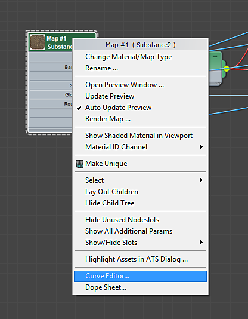

# Animation d’un matériau de Substance

Vous pouvez animer des textures de Substance à l’aide de l’éditeur de courbes dans 3ds Max.

1. Cliquez avec le bouton droit de la souris sur le nœud Substance 2 et choisissez « Éditeur de courbes ».

   
1. Cliquez sur le signe + sur la matière correspondante pour afficher tous les canaux. Les paramètres de Substance se trouvent sous les cartes répertoriées pour le matériau. La modification d’un paramètre se propage à toute la texture de Substance, quelle que soit la texture sélectionnée lors de la sélection du paramètre de Substance à animer.
1. Faites défiler la liste jusqu’à l’endroit où la carte diffuse apparaît, puis cliquez sur le signe + pour afficher les paramètres de la carte source. Vous verrez ici tous les paramètres du fichier de Substance.

   
1. Cliquez sur le paramètre à animer, puis sur le bouton Ajouter/Supprimer une clé dans la barre d’outils. Cliquez sur la ligne dans l’éditeur de courbes pour placer des images clés.

   
