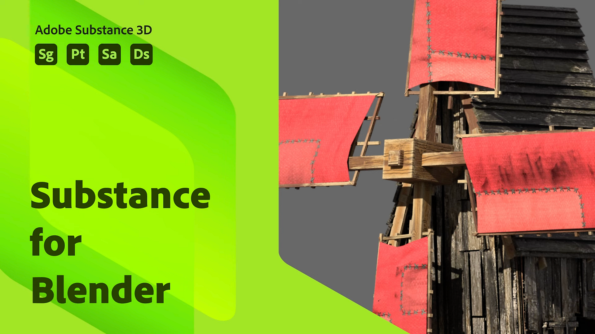

# Mélangeur

## Table des matières

* [Présentation de la Substance dans Blender](../../3d-applications/blender/in-blender-overview/substance-in-blender-overview.md)
* [Téléchargement et installation du plug-in](../../3d-applications/blender/downloading-and-ins/downloading-and-installing-the-plugin.md)
* [Préférences](../../3d-applications/blender/preferences/preferences.md)
* [Panneau Substance 3D](../../3d-applications/blender/the-3d-panel/the-substance-3d-panel.md)
* [Raccourcis et navigation](../../3d-applications/blender/shortcuts-and-navigation/shortcuts-and-navigation.md)
* [Workflows](../../3d-applications/blender/workflows/workflows.md)
* [Taille physique dans le mélangeur](../../3d-applications/blender/physical-size-in-blender/physical-size-in-blender.md)
* [Bibliothèque Substance 3D Assets](../../3d-applications/blender/3d-assets-library/substance-3d-assets-library.md)
* [Dépannage](../../3d-applications/blender/troubleshooting/troubleshooting.md)
* [Désinstallation du module complémentaire](../../3d-applications/blender/uninstalling-the-add-on/uninstalling-the-add-on.md)
* [Substance 3D Add-on for Blender Tutorials](../../3d-applications/blender/add-for-blender-tutorials/substance-3d-add-on-for-blender-tutorials.md)
