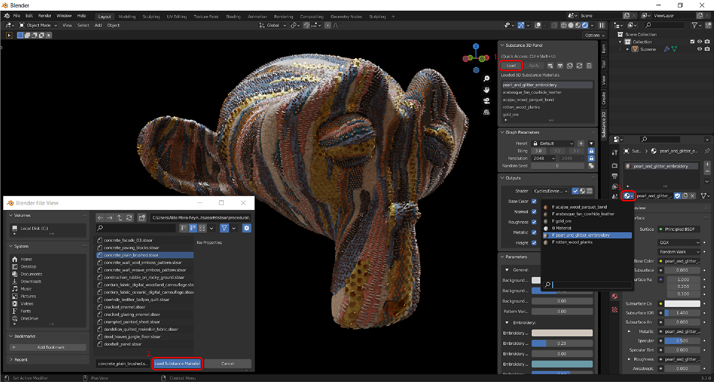

# Présentation de la Substance dans Blender

## Présentation des plug-ins

Le module complémentaire Substance 3D vous permet d’importer des matériaux de Substance dans Blender. À l’aide du panneau Substance 3D, vous pouvez gérer et personnaliser les matériaux de Substance de votre projet à partir d’un seul emplacement. Le module complémentaire génère des textures à partir de fichiers .sbsar et les utilise pour créer un matériau mélangeur. Ces textures sont mises à jour automatiquement lorsque les paramètres de Substance sont ajustés.

## Importation d&#39;une matière de Substance

1. Cliquez sur le bouton **Charger** dans le panneau Substance 3D.
1. Dans la fenêtre qui s’ouvre, accédez à l’emplacement où vos fichiers .sbsar sont stockés et sélectionnez-en un ou plusieurs. Cliquez ensuite sur le bouton **Charger le matériau de Substance**.
1. Cliquez sur l’icône en forme de sphère dans le panneau Matériau pour ouvrir la liste déroulante et sélectionner votre matériau de Substance. Cela affectera la matière à l&#39;emplacement actuel. Vous pouvez également utiliser le bouton Appliquer du panneau Substance 3D pour affecter la matière dans un nouvel emplacement de matière qui ne remplacera pas l&#39;affectation en cours.

>[!NOTE]
>
> Si l&#39;objet n&#39;a pas de matière, le bouton **Appliquer** attachera automatiquement la matière de la Substance.

## Panneau Substance 3D

Le panneau Substance 3D permet de gérer les matériaux de Substance dans un projet et d’ajuster leurs paramètres individuels. La section Paramètres de graphe contient des commandes pour la résolution, la juxtaposition, la randomisation et les préréglages de texture. La section Sorties contient des commandes pour les formats d’image des textures générées. La section Paramètre de Substance permet d&#39;ajuster les paramètres de Substance.

Pour plus d&#39;informations, consultez la page [Panneau Substance 3D](../../../3d-applications/blender/the-3d-panel/the-substance-3d-panel.md).

## Préférences

Les comportements par défaut et d’autres paramètres peuvent être ajustés dans les préférences du module complémentaire. L&#39;option « Attacher automatiquement la matière » peut être activée pour attacher automatiquement les matières de Substance aux objets et remplacer l&#39;affectation de matière en cours. L’option Mettre automatiquement en surbrillance la matière des objets sélectionnés permet de modifier la matière en surbrillance dans le panneau Substance 3D si un objet avec cette matière est sélectionné. L’activation de l’option « Cycles - Mise à jour automatique des textures » permet de mettre à jour les textures dans la fenêtre 3D lors de l’utilisation de la vue de rendu Cycles.

Le displacement peut être activé avec le bouton bascule pour l’Height dans la section Sorties. Vous pouvez également ajuster le format de fichier et le nombre de bits par pixel de chaque sortie.

Pour plus d&#39;informations, consultez la page [Préférences](../../../3d-applications/blender/preferences/preferences.md).

<table>
<tr style="border: 0;">
<td style="border: 0;" valign="top">

</td>
<td style="border: 0;" valign="top">

</td>
<td style="border: 0;" valign="top">

</td>
</tr>
</table>

## Trouver D’Autres Matériaux De Substance

Des milliers de matériaux et d&#39;autres ressources créés par des professionnels sont disponibles au téléchargement sur la [page Substance 3D Assets](https://helpx.adobe.com/substance-3d/unlisted/assets.html). De nombreuses autres ressources partagées gratuitement par la communauté sont disponibles sur la [page Ressources de la communauté Substance 3D](https://helpx.adobe.com/substance-3d/unlisted/community-assets.html)

## Communauté

Pour obtenir de l&#39;aide générale, des commentaires ou signaler des défauts, rejoignez le canal #substance-blender-beta sur le [serveur Substance Discord](https://discord.com/invite/substance3d) ou les [communautés d&#39;Adobes](https://community.adobe.com/t5/substance-3d-plugins/ct-p/ct-substance-3d-plugins?page=1&sort=latest_replies&lang=all&tabid=all&topics=label-blender).
