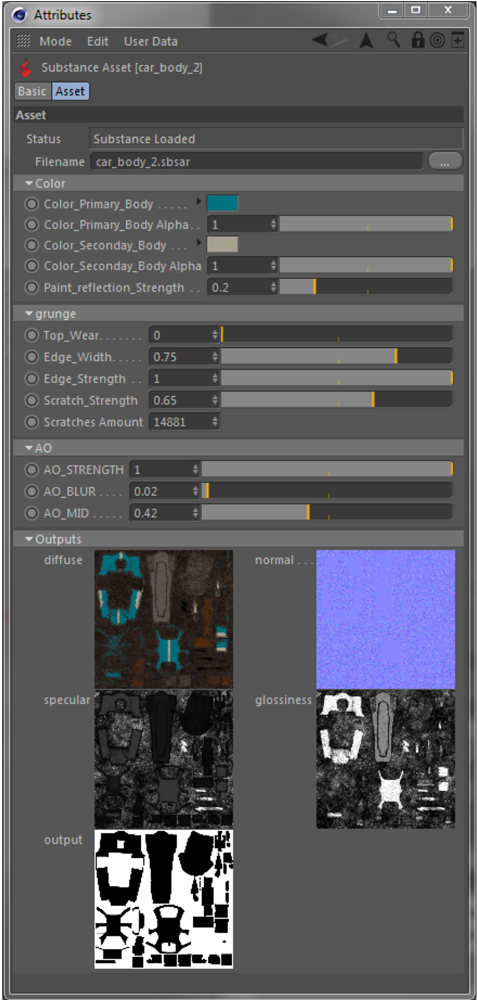

# Gestionnaire d’attributs

Le Gestionnaire d’attributs de Cinema 4D propose un nouveau mode pour les actifs de Substance.

Lorsqu&#39;une Substance est sélectionnée dans le Gestionnaire d&#39;actifs de Substance, le Gestionnaire d&#39;attributs passe automatiquement en mode d&#39;actif de Substance. Vous pouvez également passer manuellement à ce mode dans le menu du mode du gestionnaire d’attributs.

En mode Ressource de Substance, vous avez accès à toutes les entrées d’une Substance de données et vous disposez également d’une vue d’ensemble de tous les canaux de sortie.

{width="500px"}

## Regroupement des entrées de Substance

Si les entrées d’une Substance sont regroupées, ces groupes s’affichent comme tels dans le Gestionnaire d’attributs. Il existe deux groupes prédéfinis : **Propriétés de base** et **Entrées d&#39;image**.

* Dans le groupe Propriétés de base, toutes les entrées qui n&#39;étaient pas affectées à un groupe dans la Substance Designer seront affichées.
* Comme son nom l’indique déjà, toutes les entrées de Substance de données liées à des images externes sont rassemblées dans le groupe Entrées d’image.

## Paramètre Filename

En utilisant le paramètre Filename dans le Gestionnaire d’attributs, l’emplacement de fichier des actifs de Substance de données peut être modifié après leur chargement dans une scène.

{width="500px"}

Cela peut être utile non seulement pour déplacer des fichiers de Substance de données, mais également lors de l’échange d’une Substance de données avec une autre complètement différente.

Dans ce cas, il sera demandé à l’utilisateur si des références à des canaux de sortie de Substance précédents doivent être remappées sur la nouvelle Substance.

{width="500px"}

Si la réponse à la question est « Non », les liens vers la Substance précédente seront supprimés de tous les nuanceurs de Substances. Afin de remapper les canaux de sortie, le plug-in recherchera d&#39;abord des canaux de sortie du même type, puis avec le même nom.

## Paramètre à trois états

Si plusieurs Substances sont sélectionnées en même temps, les entrées partagées entre ces Substances s&#39;affichent sous la forme de trois états et peuvent être modifiées pour toutes les Substances sélectionnées simultanément (comme tous les autres paramètres de la Cinema 4D).

Dans ce cas, les canaux de sortie s’affichent comme indiqué ci-dessous.

{width="300px"}
