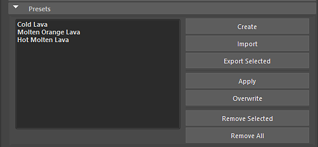

# Préréglages

Dans la section Paramètres prédéfinis, vous pouvez gérer entièrement les paramètres prédéfinis incorporés dans le fichier sbsar de Substance ou créer de nouveaux paramètres prédéfinis.

Pour créer un paramètre prédéfini, modifiez les paramètres de Substance, puis cliquez sur le bouton Créer.

Pour appliquer un paramètre prédéfini, sélectionnez-le dans le menu, puis cliquez sur Appliquer. Si vous devez remplacer un paramètre prédéfini, vous pouvez le sélectionner dans le menu et cliquer sur le bouton Remplacer. Cette opération met à jour le paramètre prédéfini avec les nouveaux paramètres. Vous pouvez également importer et exporter des fichiers de paramètres prédéfinis de Substance (.sbsprs).
