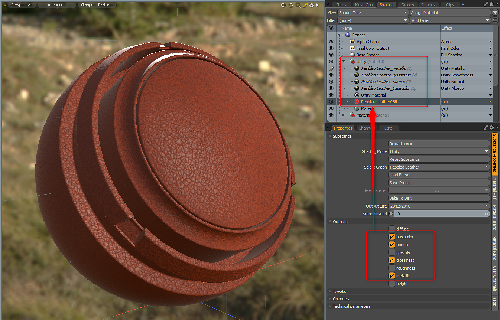
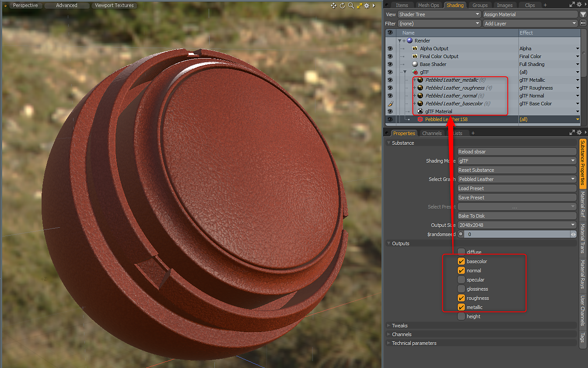

# Matériaux personnalisés

Le plug-in Substance prend en charge les matériaux personnalisés Unreal, Unity et glTF. Avant de charger un fichier sbsar, vous pouvez sélectionner le mode ombrage à utiliser.

## Table des matières

## Matériau Unity

Lorsque vous utilisez le Matériau Unity, l’effet de calque de Matériau est défini automatiquement. Le module externe de Substance place le Matériau Unity directement au-dessus du Matériau d’élément de Substance.

| Sortie de Substance | Espace colorimétrique | Effet de calque de matériau |
| --- | --- | --- |
| Couleur de base | sRVB | Albédo d’unité |
| Brillance | Linéaire | Smoothness Unity |
| Métallique | Linéaire | Unity Métallique |
| Normale | Linéaire | Unité normale |
| Émissif | sRVB | Émission Unity **\*définie sur sRGB sur l&#39;image fixe** |
| Hauteur | Linéaire | Unity Bump |
| Occlusion ambiante | Linéaire | Ambient occlusion d’unité |

{width="600px"}

## Matériau irréel

Lorsque vous utilisez le Matériau irréel, l’effet de calque de Matériau est défini automatiquement. Le module externe de Substance place le Matériau irréel directement au-dessus du Matériau de l’élément de Substance.

| Sortie de Substance | Espace colorimétrique | Effet de calque de matériau |
| --- | --- | --- |
| Couleur de base | sRVB | Base color irréelle |
| Rugosité | Linéaire | Rugosité irréelle |
| Métallique | Linéaire | Métallique irréel |
| Normale | Linéaire | Irréel normal |
| Hauteur | Linéaire | Bosselage irréel |
| Émissif | sRVB | Emissive irréelle **\*définie sur sRGB sur l&#39;image fixe** |
| Occlusion ambiante | Linéaire | Ambient occlusion irréel |
| Opacité | Linéaire | L&#39;opacité irréelle **\*doit être désactivée sur le calque de Texture** |

{width="600px"}

Vous devrez peut-être inverser la normale. Pour ce faire, utilisez le menu Réglages si la Substance dispose d’un contrôle d’orientation normale. Sinon, cela peut être fait sur la texture elle-même. Pour plus d&#39;informations, consultez la page « **[Utilisation des normales](../../../3d-applications/modo/working-with-normals/working-with-normals.md)** ».

## matériau glTF

Lorsque vous utilisez le Matériau glTF, l’effet de calque de Matériau est défini automatiquement. Le module externe de Substance place le Matériau glTF directement au-dessus du Matériau d’élément de Substance.

| Sortie de Substance | Espace colorimétrique | Effet de calque de matériau |
| --- | --- | --- |
| Couleur de base | sRVB | base color glTF |
| Rugosité | Linéaire | rugosité glTF |
| Métallique | Linéaire | glTF Métallique |
| Normale | Linéaire | glTF Normal |
| Émissif | sRVB | emissive glTF **\*définie sur sRGB sur l&#39;image fixe** |
| Occlusion ambiante | Linéaire | ambient occlusion glTF |

{width="600px"}

Vous devrez peut-être inverser la normale. Pour ce faire, utilisez le menu Réglages si la Substance dispose d’un contrôle d’orientation normale. Sinon, cela peut être fait sur la texture elle-même. Pour plus d&#39;informations, consultez la page « **[Utilisation des normales](../../../3d-applications/modo/working-with-normals/working-with-normals.md)** ».
