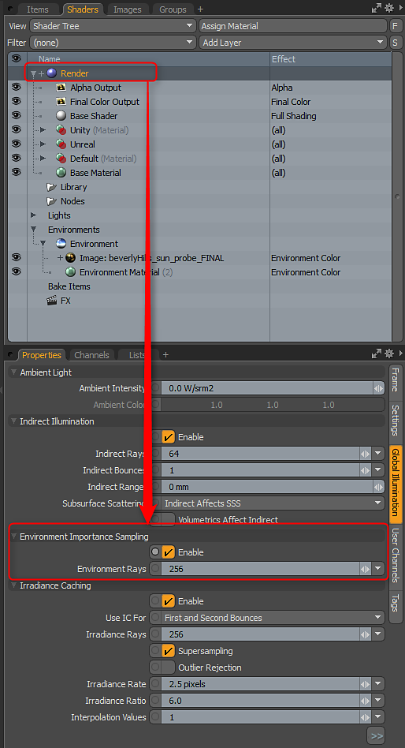

# Environnement et configuration du rendu

## Configuration et rendu de l’environnement

Pour obtenir de meilleurs résultats avec le rendu basé physiquement et la configuration avancée de la fenêtre d’affichage, vous devez utiliser un mappage HDR dans l’environnement. MODO est livré avec plusieurs paramètres prédéfinis Environnement disponibles dans l’onglet Disposition.\
Une fois que vous avez chargé un environnement HDR, vous devez définir les options avancées d’éclairage de la fenêtre et d’arrière-plan. Vous pouvez appuyer sur la touche O pour afficher les propriétés de la fenêtre d’affichage 3D et, dans les Options avancées, définir l’option\
Éclairage et environnement à l’option Environnement. Vous pouvez également utiliser Scène + Environnement pour l’éclairage si vous disposez de lumières de scène.

## Échantillonnage d’importance

La fenêtre d’affichage Substance Designer 3D utilise l’échantillonnage d’importance. Pour obtenir de meilleurs résultats lors du rendu, vous devez activer l’échantillonnage d’importance pour le rendu MODO. Pour ce faire, utilisez l&#39;onglet Illumination globale des Paramètres de rendu.

