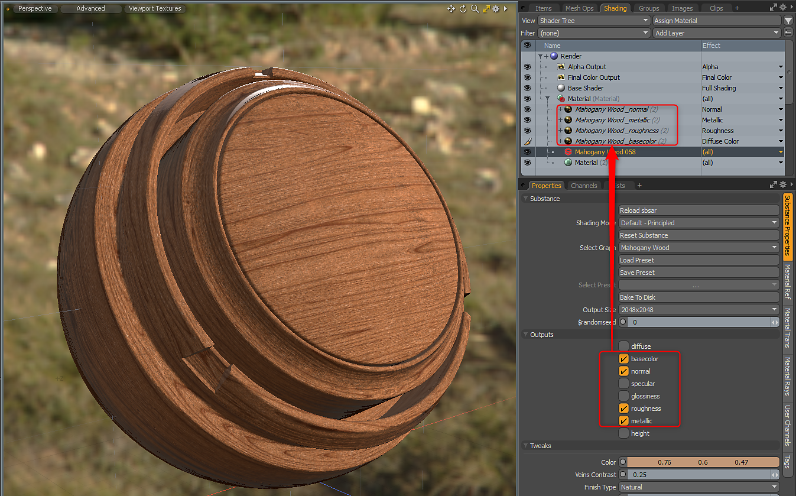

# Présentation de la Substance dans MODO

## Présentation :

## Ouverture d’une Substance

1. Créez un matériau ou sélectionnez un groupe de matériaux.
1. Sous Texture > Substance, choisissez Créer une Substance ou utilisez le bouton Créer sous les options du kit de Substance. Cela créera un matériau de Substance dans l&#39;arbre de shader.
1. Cliquez sur le sbsar Charger pour charger un fichier sbsar.

   

## Création de sorties

À l&#39;aide du **Mode Ombrage par défaut - Principe**, vous pouvez créer des sorties à l&#39;aide du workflow métallique/rugosité.

1. Dans la section Sorties des Propriétés de la Substance, cliquez sur les sorties nécessaires à l’ombrage. La texture de Substance sera générée et ajoutée à l’arbre du Shader avec l’effet de calque de Matériau approprié. Pour le mode Ombrage avec principes, vous aurez besoin des éléments suivants :

   | Sortie de Substance | Espace colorimétrique | Effet de calque de matériau (mode Ombrage de principe) |
   | --- | --- | --- |
   | Couleur de base | sRVB | Couleur diffuse |
   | Normale | Linéaire | Normal |
   | Rugosité | Linéaire | Rugosité |
   | Métallique | Linéaire | Métallique |

   

## Modification de la résolution/des paramètres

Vous pouvez modifier les paramètres de Substance pour mettre à jour ou modifier les textures générées. La modification d&#39;un paramètre entraîne le recalcul par la Substance Engine des textures qui sont introduites dans le matériau MODO.

1. Accédez aux Propriétés de Substance du Matériau Substance et, dans la section Modifications, modifiez l’un des paramètres.

   
1. Vous pouvez modifier la résolution des textures générées à l’aide du menu déroulant Taille de sortie. Les Substances peuvent être définies pour générer jusqu’à 8K. Le [moteur GPU Substance](../../../3d-applications/modo/modo-switch-engine/modo-switch-engine.md) est requis pour la sortie 8K.
