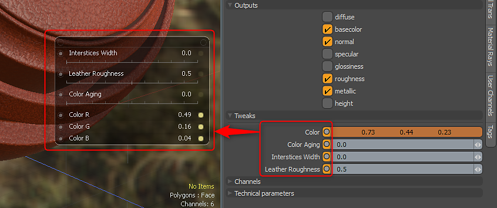

# Paramètres

Une Substance a un ensemble de paramètres de base. Ces paramètres sont divisés en Substance, Sorties et Modifications. Ils se trouvent dans le panneau Propriétés de la Substance.\
La Substance de la Substance Source contiendra les paramètres techniques et les canaux. Les options Couches n’ont aucun effet dans MODO. Les sorties sont activées/désactivées à l’aide de la section Sorties.

{width="300px"}

## Substance

Une Substance est dotée d&#39;un ensemble de paramètres principaux qui se trouvent dans la catégorie Substance du panneau Propriétés de la Substance.

* **Recharger la Substance :** ce paramètre vous permet de recharger une Substance. Il est conçu pour être utilisé avec Substance Designer. Si vous travaillez sur une Substance personnalisée et que vous avez ajouté une nouvelle modification ou une nouvelle sortie, vous pouvez recharger la Substance nouvellement publiée dans MODO. Les nouvelles modifications et sorties seront ajoutées et les paramètres de modification précédents seront conservés.
* **Mode d&#39;Ombrage :** ces paramètres vous permettent de définir le mode d&#39;ombrage à utiliser pour la Substance. Principe (par défaut), Irréel, Unitaire ou glTF.
* **Réinitialiser la Substance :** ce paramètre réinitialisera les réglages aux paramètres par défaut.
* **Sélectionner le graphique :** vous permet de choisir le graphique dans le fichier de Substance à partir duquel créer un matériau.
* **Charger le paramètre prédéfini :** vous pouvez charger un paramètre prédéfini, qui configurera les paramètres de réglage de la Substance. Les paramètres prédéfinis peuvent être créés à l’aide de la Substance Player. Le fichier prédéfini est de type .sbsprs. Une fois que vous avez chargé un paramètre prédéfini, vous devez ensuite cliquer sur le menu déroulant Paramètre prédéfini et choisir le paramètre prédéfini car .sbsprs peut contenir plusieurs paramètres prédéfinis.
* **Enregistrer le paramètre prédéfini :** vous permet d&#39;enregistrer un paramètre prédéfini
* **Sélectionner le paramètre prédéfini :** vous permet de choisir un paramètre prédéfini incorporé dans le fichier de Substance de données ou parmi les paramètres prédéfinis enregistrés dans MODO.
* **Cuire sur disque :** ce paramètre va cuire les textures générées par la Substance dans un fichier bitmap.
* **Taille de sortie :** ce paramètre redimensionnera dynamiquement la texture à la taille définie. La Substance Engine régénère la texture à la taille souhaitée.
* **Générateur aléatoire :** ce paramètre fait varier la génération procédurale de la Substance. Ce paramètre est idéal pour créer une version randomisée de la même Substance. Cela vous permet de faire varier rapidement les paramètres de Substance pour générer une nouvelle version des textures

## Sorties

Les options Sortie vous permettent d’activer ou de désactiver les sorties de Substance. Une sortie correspond à ce qui est généré par la Substance Engine et rendu sous forme de texture dans l’arborescence du nuanceur.

{width="300px"}

## Ajustements

Les ajustements sont des paramètres créés dans le fichier de Substance de données et modifiables dans MODO. Vous pouvez sélectionner des canaux et, en mode Elément, utiliser la traversée de canal pour obtenir les contrôles ensemble dans un contrôleur pop-up.

{width="300px"}
