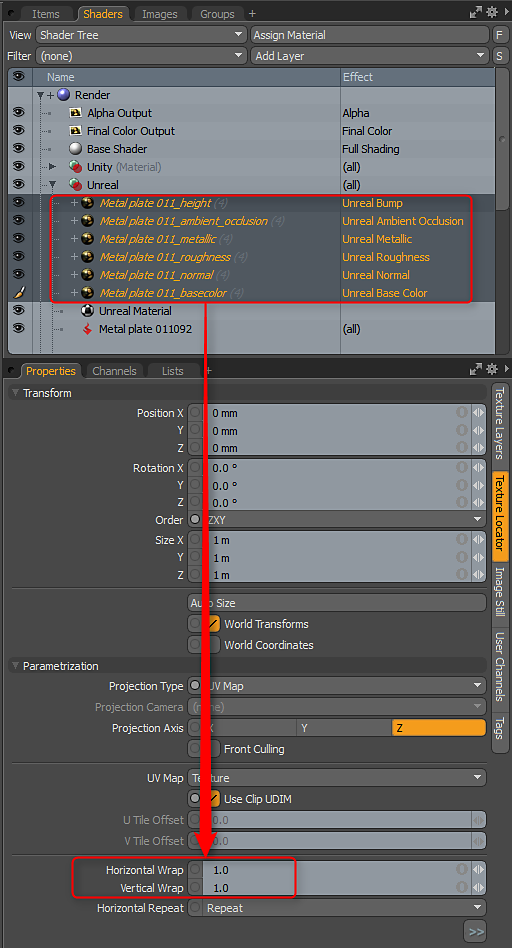

# Répétition des textures d’ambiance

Vous pouvez régler les propriétés d’une Texture de Substance de la même manière que n’importe quelle texture dans MODO. Pour appliquer une mosaïque aux textures, vous pouvez définir l’habillage horizontal et vertical.

