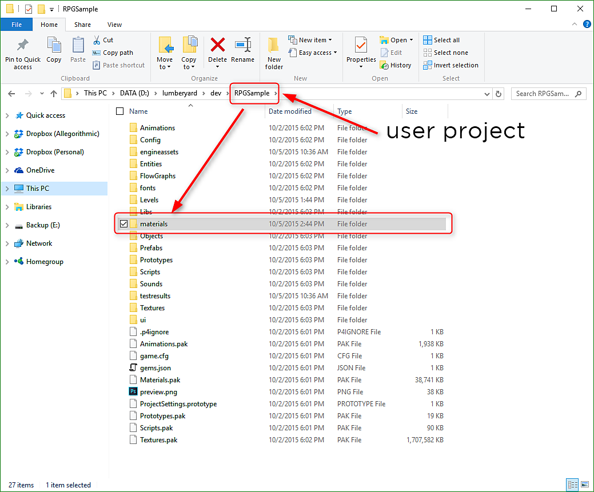

# Importation d’une Substance

Un matériau Substance peut être importé dans votre projet. Une fois le fichier substance matériau (.sbsar) copié dans le dossier du projet, vous pouvez utiliser l&#39;éditeur de Matériau Procédural pour importer la substance dans votre projet et modifier les paramètres de substance.

1. Copiez le matériau substance (.sbsar) dans le dossier « matériaux » de votre projet. Vous pouvez créer des sous-répertoires dans le dossier matériau à des fins d’organisation.

   
1. Cliquez sur le bouton Procédural de l’éditeur de Matériau en haut de l’interface utilisateur du chantier naval pour ouvrir la boîte de dialogue. Dans la boîte de dialogue Éditeur de Matériaux Procédural, choisissez Fichier > Importer la Substance et accédez au fichier substance que vous avez copié dans le dossier matériau de votre projet à l’étape 1. Une fois toutes les substances importées, vous pouvez fermer la boîte de dialogue.

   
