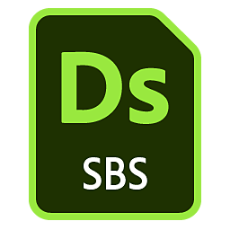

# Roblox

[Roblox](https://www.roblox.com/) est une plateforme destinée aux expériences multijoueurs 3D immersives. Roblox Studio, l’outil de conception Roblox, prend en charge le flux de production de la rugosité métallique PBR.

<table>
<tr style="border: 0;">
<td width="58.30%" style="border: 0;" valign="top">

## modèle Substance 3D Designer

Pour créer des textures pour Roblox, vous pouvez utiliser le fichier Substance 3D ci-dessous comme modèle de [graphes de composition de Substances](https://experienceleague.adobe.com/fr/docs/substance-3d-designer/using/substance-graphs/substance-compositing-graphs) dans [Substance 3D Designer](https://experienceleague.adobe.com/en/docs/substance-3d-designer/home).

[{width="64px"}](https://helpx.adobe.com/content/dam/roblox.sbs)

Ce modèle de graphique permet la préconfiguration des noms et des types de fichiers de texture finale. Ce modèle peut être installé et réutilisé pour créer de nouveaux matériaux qui suivent toujours les directives de matériau Roblox.

</td>
<td width="41.60%" style="border: 0;" valign="top">

{width="200px"}

</td>
</tr>
</table>

## Workflow Designer vers Roblox

<table>
<tr style="border: 0;">
<td style="border: 0;" valign="top">

### Installer le modèle

Commencez par *installer* le modèle Roblox.

* Téléchargez le fichier modèle lié ci-dessus.
* Accédez au répertoire de documents utilisateur Designer :
* (Bureau Creative Cloud) `/Documents/Adobe/Adobe Substance 3D Designer`\
  (Vapeur) `/Documents/Allegorithmic/Substance Designer/`
* Créez un dossier de modèles.
* Placez le fichier dans ce dossier.

</td>
<td style="border: 0;" valign="top">

{width="512px"}

</td>
</tr>
</table>

<table>
<tr style="border: 0;">
<td style="border: 0;" valign="top">

### Détecter le modèle

Ensuite, demandez à Designer de *consulter* le dossier des modèles pour rechercher des modèles de graphe.

* Dans Designer, accédez à **Modifier > Préférences...**
* Dans la fenêtre [Préférences](https://experienceleague.adobe.com/fr/docs/substance-3d-designer/using/workspace/preferences/preferences-window), accédez à **Projets > Projet utilisateur > Général**
* Dans la liste **Répertoires de modèles**, cliquez sur le bouton **+**
* Accédez au répertoire `templates` et cliquez sur **Sélectionner un dossier**
* Cliquez sur le bouton **OK**
* Accédez à **Fichier > Nouveau > graphe de Substance...**
* Vérifiez que le modèle `Roblox` est répertorié en bas de la liste des modèles dans la fenêtre [Nouveau graphe de Substance](https://helpx.adobe.com/fr/substance-3d/unlisted/documentation/sddoc/create-a-graph-102400068.html)

</td>
<td style="border: 0;" valign="top">

{width="512px"}

</td>
</tr>
</table>

<table>
<tr style="border: 0;">
<td style="border: 0;" valign="top">

### Exporter les textures

Créez un graphe à l’aide du modèle Roblox et exportez les bitmaps en dehors de ce graphe une fois que vous avez terminé de travailler sur un matériau.

* Dans la fenêtre [Nouveau graphe de Substance](https://helpx.adobe.com/fr/substance-3d/unlisted/documentation/sddoc/create-a-graph-102400068.html), sélectionnez le modèle `Roblox`
* Définissez un identifiant et d&#39;autres paramètres pour le graphe et cliquez sur **OK**
* Travaillez sur votre matériau dans la [Vue du graphe](https://experienceleague.adobe.com/fr/docs/substance-3d-designer/using/workspace/graph-view/the-graph-view). Reportez-vous [ici](https://experienceleague.adobe.com/fr/docs/substance-3d-designer/using/getting-started/workflow-overview) pour commencer à utiliser le workflow
* Une fois que vous avez terminé, accédez à **Outils > Exporter les bitmaps...** dans la *barre d’outils* de la Vue du graphe de données
* Dans la fenêtre [Exporter les bitmaps](https://experienceleague.adobe.com/fr/docs/substance-3d-designer/using/substance-graphs/exporting-bitmaps), définissez un chemin **Destination** valide, assurez-vous que *toutes* les sorties sont *sélectionnées* et cliquez sur **Exporter**
* Vérifiez que les textures sont correctement exportées vers le chemin de **destination**

</td>
<td style="border: 0;" valign="top">

{width="512px"}

</td>
</tr>
</table>

<table>
<tr style="border: 0;">
<td style="border: 0;" valign="top">

### Création d’un matériau dans Roblox

Dans Roblox, créez une variante de Matériau et attribuez les textures exportées depuis Designer.

* Sélectionnez l&#39;onglet **Modèle** et cliquez sur **Gestionnaire de Matériaux**
* Sélectionnez un *modèle de matériau* et cliquez sur le bouton **Créer une variante**
* Dans la fenêtre **Créer une variante**, définissez un nom pour le matériau
* Pour *chaque couche de matière*, cliquez sur le bouton **Importer** et sélectionnez la texture correspondante exportée depuis Designer
* Cliquez sur **Enregistrer**

</td>
<td style="border: 0;" valign="top">

{width="512px"}

</td>
</tr>
</table>

<table>
<tr style="border: 0;">
<td style="border: 0;" valign="top">

### Application de matières

Utilisez votre nouvelle variante de matériau dans votre scène Roblox

* *Sélectionnez* une ou plusieurs parties ou un ou plusieurs maillages dans votre scène Roblox
* Dans le **Gestionnaire de matériaux**, sélectionnez votre *variante de matériau* et cliquez sur le bouton **Appliquer aux pièces sélectionnées**

>[!NOTE]
>
> Si la couleur des textures semble différente dans Roblox, vérifiez l&#39;attribut **Couleur** sous la catégorie **Apparence** dans les propriétés de l&#39;objet auquel la variante Matériau est appliquée et assurez-vous qu&#39;il est défini sur *blanc pur*, c&#39;est-à-dire RGB (255, 255, 255), qui est étiqueté *Blanc institutionnel* dans Roblox.

</td>
<td style="border: 0;" valign="top">

{width="512px"}

</td>
</tr>
</table>

<table>
<tr style="border: 0;">
<td style="border: 0;" valign="top">

### Ajuster la mosaïque

La quantité de répétition du matériau sur une surface, c&#39;est-à-dire le carrelage, peut être ajustée à tout moment.

* Dans le **Gestionnaire de matériaux**, sélectionnez votre *variante de matériau* et cliquez sur le bouton **Modifier**
* Dans la fenêtre **Modifier la variante**, ajustez la valeur de la propriété **Tiges par carreau** sous **Supplémentaire** : une valeur *inférieure* entraîne une répétition *plus*

</td>
<td style="border: 0;" valign="top">

{width="512px"}

</td>
</tr>
</table>
