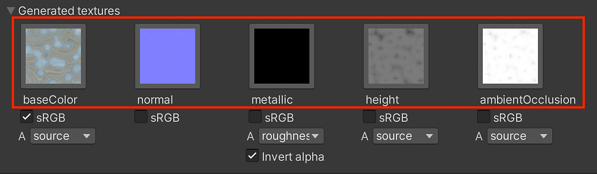
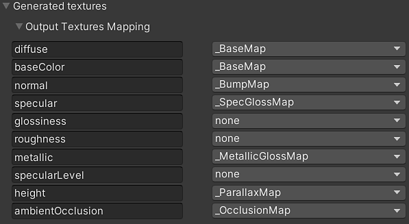

# Textures générées (par Packing)

Les Textures générées affichent les sorties de la Substance qui sont calculées par la Substance Engine pour créer des textures. Ces textures sont introduites dans les apports en shader. Par défaut, seules les entrées de base utilisées par le shader sont créées. Si « Générer toutes les sorties » est activé, toutes les textures seront affichées ici.

Lorsque « Générer toutes les sorties » est activé

## Utilisation

1. La sélection d’une icône de texture entraîne la sélection de la texture dans la fenêtre Projet. Cela ne fonctionne pas pour les matériaux d’exécution, car les textures ne sont pas générées dans le dossier du projet.
1. Le bouton sRVB fonctionne de la même manière que l’option sRVB (texture des couleurs) dans les paramètres d’importation de Texture. Elle permet de définir si une texture doit être interprétée dans un espace gamma (sRVB) ou linéaire. Le module externe Substance gère automatiquement cette interprétation, mais il peut être remplacé si nécessaire.

   | Sortie de Substance | sRVB |
   | --- | --- |
   | Base color | Activé |
   | Diffuse | Activé |
   | Spéculaire | Activé |
   | Normale | Désactivé |
   | Métallique | Désactivé |
   | Rugosité | Désactivé |
   | Brillance | Désactivé |
   | Hauteur | Désactivé |
   | Occlusion ambiante | Désactivé |

## Couches packings

Vous pouvez compresser une texture dans le canal Alpha d’une autre texture à l’aide du menu déroulant. Chaque texture générée a un menu déroulant qui contient une liste de toutes les sorties de texture générées par les matériaux de Substance. Choisissez simplement un mappage dans la liste pour le compresser dans le canal Alpha de la texture. L’option Source correspond au canal Alpha de la texture.

Dans cette image, j’ai sélectionné la map height :

Dans l’image ci-dessous, vous pouvez voir que la sortie height est compressée dans le canal Alpha de la feuille de base color.

## Mappage des Textures de sortie

En outre, la texture de sortie peut être affectée individuellement aux entrées de surface des matériaux d’unité via la section Correspondance de Texture de sortie. Les textures de sortie générées par le fichier .sbsar seront affichées dans la colonne de gauche et les entrées Unity Surface disponibles apparaissent dans la colonne de droite. Ces dernières peuvent être modifiées via les listes déroulantes.

