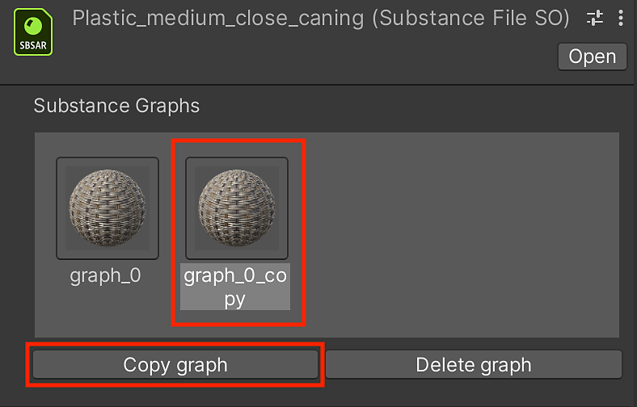

# Gestion des Graphes Substance

## Gestion des Graphes Substance

Vous pouvez créer de nouveaux matériaux à partir du matériau de Substance à l’aide du Gestionnaire de Graphes Substance (SGM).

1. Cliquez sur l’objet racine sbsar dans la fenêtre Projet.

   
1. Dans l’Inspecteur, vous pouvez créer un nouveau matériau en cliquant sur le bouton Copier le graphique dans la fenêtre du gestionnaire, comme indiqué à l’étape 1.

   
1. Un nouvel objet matériau et Graphe Substance (SGO) est créé dans le projet.
1. Vous pouvez cliquer sur le bouton « Supprimer le graphique » pour supprimer correctement la matière.

   
