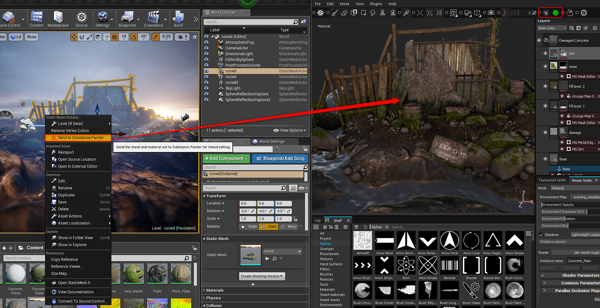

# Live Link dans UE4

>[!WARNING]
>
> Live Link dans Unreal Engine n’est plus pris en charge. Les utilisateurs disposant d’une ancienne version du plug-in où Live Link est utilisé pourront toujours utiliser la fonctionnalité.

>[!WARNING]
>
> Live Link ne fonctionne pas avec les maillages UE4 BSP. La ressource que vous envoyez doit être un fichier de modèle importé dans votre projet UE4

## Établissement d’un lien vers la Substance Painter

1. Substance Painter ouverte
1. Cliquez avec le bouton droit de la souris sur la ressource que vous souhaitez envoyer à Painter dans l’Explorateur de contenu et choisissez « Envoyer à Painter ».

   {width="400px"}
1. Le maillage apparaîtra dans la Substance Painter et vous pourrez commencer la texturation. Pendant que vous travaillez, les textures seront envoyées à UE4 et appliquées aux matériaux. Le point vert sur l’icône UE4 de la barre d’outils indique que le lien est en direct et qu’il envoie des textures.

   

   1. Vous pouvez interrompre la diffusion des données dans les options de configuration du plug-in. Accédez à Plug-ins > dcc-live-link et choisissez Configurer. Désactivez l&#39;option Activer la diffusion en continu pour interrompre l&#39;envoi des données à UE4.

      
1. Les textures de Painter apparaîtront dans l&#39;Explorateur de contenu et seront appliquées au matériau dans UE4.

   {width="500px"}
1. Un projet de Substance Painter (.spp) sera créé dans le dossier du projet UE4 dans un dossier intitulé  ».sp »

   

## Rétablissement d’un lien vers la Substance Painter

Vous pouvez reprendre là où vous vous étiez arrêté après avoir fermé Painter ou Unity.

1. Ouvrez le projet .spp dans la Substance Painter située dans votre dossier Projet Unity > Actifs >.sp.
1. Cliquez avec le bouton droit de la souris sur le maillage dans l’Explorateur de contenu et choisissez « Envoyer vers Painter » pour rétablir le lien.

   {width="600px"}
