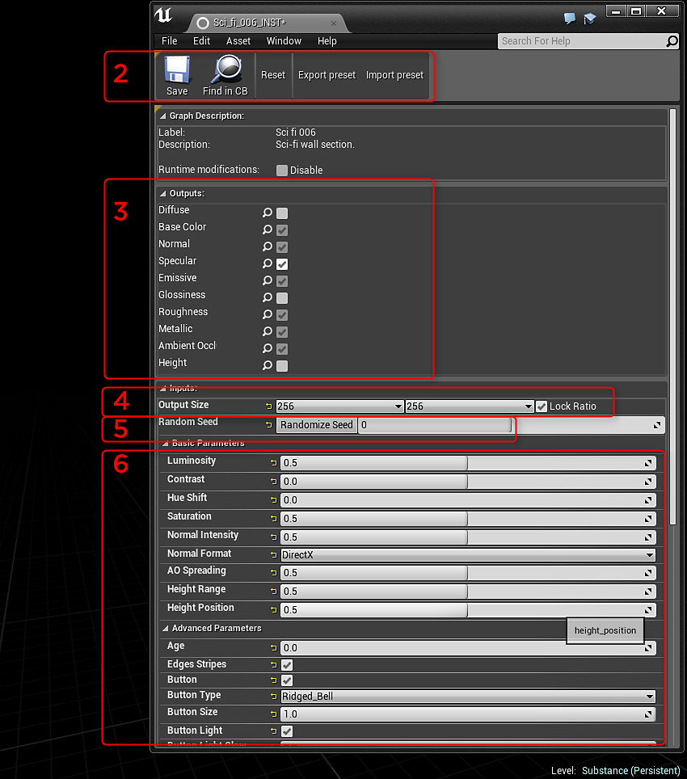

# Présentation du plug-in - UE4

## Importation d’une Substance

1. Dans l’Explorateur de contenu, cliquez sur le bouton Importer et recherchez le fichier de Substance .fichier sbsar.
1. Dans les options d’importation de la Substance de données, vous pouvez définir l’INST et le nom du Matériau qui seront créés. L&#39;importation créera une Substance INST et Factory avec les textures générées. Un matériau UE4 sera créé avec les textures de Substance en entrée des canaux de matériau.

## Modification des paramètres

1. Cliquez deux fois sur l’élément INST de Substance pour ouvrir la fenêtre Paramètres.
1. Le bouton Réinitialiser réinitialise les paramètres Substance à leur valeur par défaut. Le paramètre prédéfini Exporter et Importer exportera un fichier de paramètre prédéfini de Substance (.sbspr) à l’aide des valeurs définies dans l’éditeur. Vous pouvez également importer un paramètre prédéfini.
1. Dans Sorties, vous pouvez désactiver et activer les sorties qui génèrent des textures.
1. La taille de sortie vous permet de modifier la taille de la texture.
1. Générateur aléatoire modifie la valeur de départ pour générer les textures. C’est une bonne chose pour l’affichage aléatoire des matériaux.
1. La section Paramètres vous permet d’ajuster le matériau.

{width="600px"}
