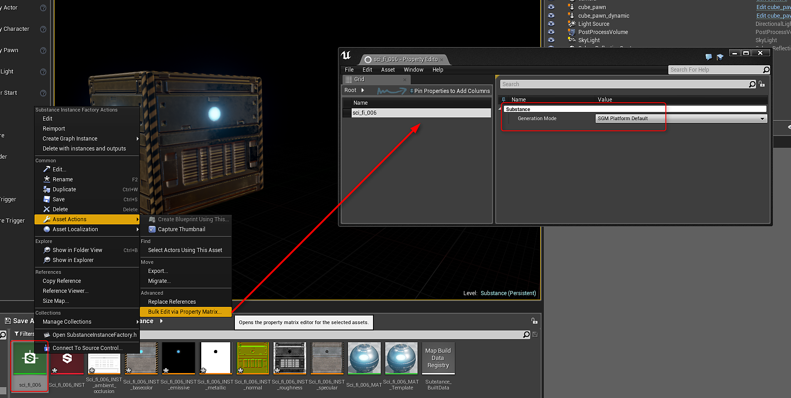

# Paramètres du plug-in - UE4

Pour accéder aux paramètres, accédez à Modifier > Paramètres du projet, faites défiler jusqu’à la catégorie Plug-ins et cliquez sur Substance.

{width="400px"}

## Budget matériel

Le budget mémoire est la quantité maximale de mémoire à utiliser pour le moteur Substance. Peut être augmenté pour améliorer la vitesse de traitement des substances, mais consommera plus de ressources système. (Pas toujours une augmentation utile au niveau du projet).

Les cœurs du processeur correspondent au nombre de cœurs que le moteur de Substance de données est autorisé à utiliser. Cela inclut les cœurs physiques et les hyper-threads. (Si le nombre attribué est supérieur aux cœurs disponibles sur un système, tous les cœurs disponibles seront utilisés par défaut.

## Cuisiner

Le comptage des niveaux de mélange supprimé pendant la cuisson modifiera la façon dont les textures sont créées pour un pack. Ce paramètre peut considérablement améliorer les temps de chargement et réduire la taille du package, car les niveaux de texture plus élevés n’auront plus besoin d’être chargés. La plus faible résolution / les plus petites LOD seront chargées et la plus élevée sera définie par défaut par l&#39;UE4. Les substances sont ensuite traitées par le moteur de substance et mises à jour au moment de l&#39;exécution avec les valeurs de niveau de détail à haute résolution.

La Substance Engine peut être CPU ou GPU. Le moteur GPU vous permettra de créer des textures 4K. Le moteur CPU est limité à 2 K.

## Génération par défaut :

Le mode de génération de Substance (SGM) contrôle la façon dont les textures sont générées. Il s’agit d’un paramètre global pour les Substances. Le SGM peut être modifié par Substance sur Substance Factory.

**SGM Baked** : cuit les textures de substance. Vous perdez la possibilité de modifier les paramètres lors de l’exécution.

**SGM lors de la synchronisation de chargement** : bloque l&#39;application pendant le chargement des Substances.

**SGM lors de la synchronisation de chargement et du cache** : met en cache un résultat intermédiaire de la texture sur le disque.

**SGM lors du chargement asynchrone** : non bloquant. Les Substances sont générées en arrière-plan.

**SGM lors du chargement asynchrone et du cache** : met en cache un résultat intermédiaire de la texture sur le disque.

***La valeur par défaut de la plateforme est Charger asynchrone et cache***

## Substance Factory

Pour modifier le SGM d&#39;une Substance, cliquez avec le bouton droit de la souris sur Substance Factory>Asset Actions>Bulk Edit via Property Matrix. Vous pouvez ensuite modifier le SGM.

{width="800px"}

## Optimisation :

Cela limite le nombre de substances asynchrones pouvant être transmises au moteur Substance par lot. Des valeurs basses accélèrent la rapidité d’exécution d’une tâche asynchrone et sa mise à jour, les valeurs élevées effectuant des rendus par lots et traitant plusieurs substances à la fois. Plus le nombre de mises à jour est élevé, plus la texture devient saccadée, car l’intervalle de temps entre les mises à jour est long.

## Rendu asynchrone/synchronisé

Le rendu de synchronisation est un appel de rendu bloquant. Une instance de graphique de substance est alors transmise au moteur Substance pour être recalculée, mais l’exécution s’arrête jusqu’à ce que le moteur Substance ait terminé de traiter la substance avant de poursuivre l’exécution du code. Le résultat sera également mis à jour sur votre écran dès que le processus sera terminé.

Async ajoute votre graphique à une file d’attente et envoie plusieurs graphiques au moteur Substance à la fois (définis dans les paramètres Substance) dans la mise à jour du plug-in. Contrairement au rendu de synchronisation, dès qu’ils sont envoyés, le programme continue de fonctionner comme d’habitude au lieu d’attendre que le moteur Substance soit terminé. Lorsque le moteur Substance a terminé ce lot, il renvoie les résultats, nous les appliquons aux sorties et nous lançons un autre lot.
