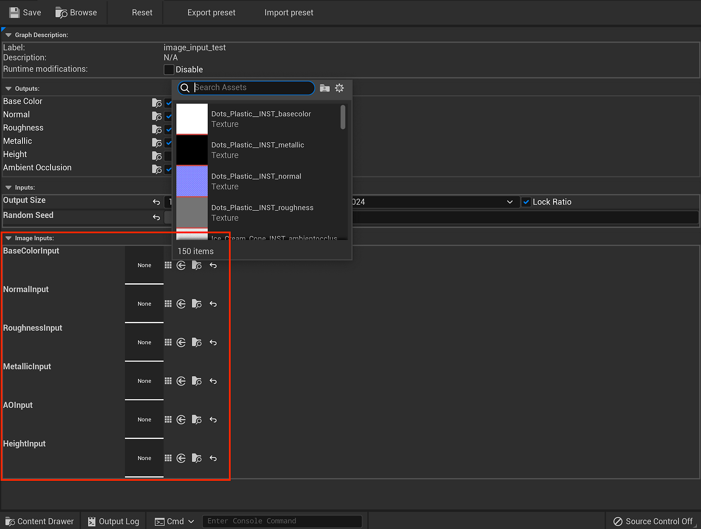

# Image d’entrée de Substance - UE5

Des Substances peuvent être créées avec des entrées permettant de fournir une image à traiter dans le matériau. Cela vous permet de créer des matériaux modulaires qui peuvent prendre des données ou des motifs de maillage cuits comme entrée pour modifier ou confirmer le matériau à la ressource.

* Vous pouvez utiliser UTexture2D avec une entrée de Substance.

