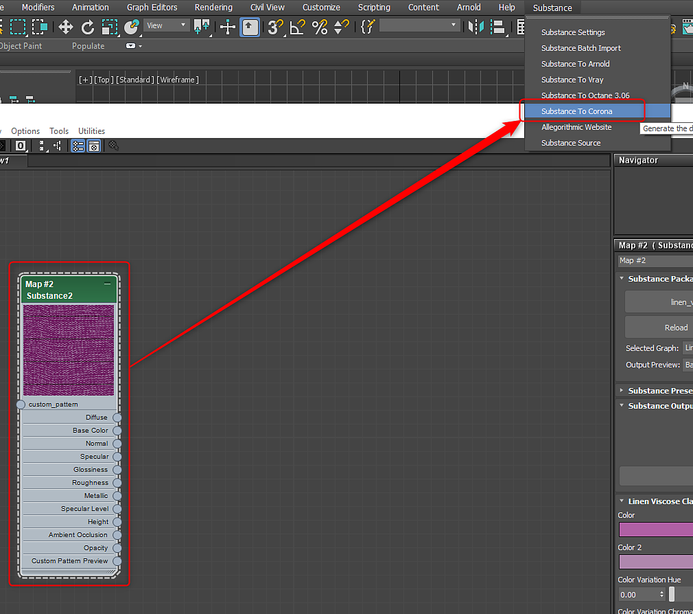

# Corona pour 3ds Max

## Substance dans le plug-in Maya

## Corona 1.6 - 6

À l&#39;aide du plug-in [3ds Max](../../../3d-applications/3ds-max/3ds-max.md), vous pouvez choisir Corona dans le menu Substance pour configurer automatiquement le matériau Corona avec les entrées de texture de Substance.

{width="500px"}

## Corona 7 - 9

Pour le rendu Corona 7 et supérieur, la sélection de « Substance vers Corona » avec le nœud Substance 2 sélectionné créera un réseau pour le Matériau physique Corona.

* **LiftGamaGain** est créé entre la sortie de Base color et l&#39;entrée de Base color. Une valeur gamma de 0,455 est utilisée pour corriger la différence de couleur.
* **CoronaNormal** est créé entre la sortie Normal et l&#39;entrée de relief de base, ainsi qu&#39;entre la sortie Coat normal et l&#39;entrée de relief Clearcoat. Aucun paramètre n’est modifié, mais vous pouvez modifier les valeurs normales ici.
* **CoronaMix** est créé entre la sortie de Couleur de l&#39;éclat et l&#39;entrée de Couleur de l&#39;éclat. Une quantité de mélange de 0 est définie et un multiplicateur de 2 est défini pour le calque de base. Les utilisateurs peuvent régler la valeur Quantité mixte pour contrôler l’éclat.
