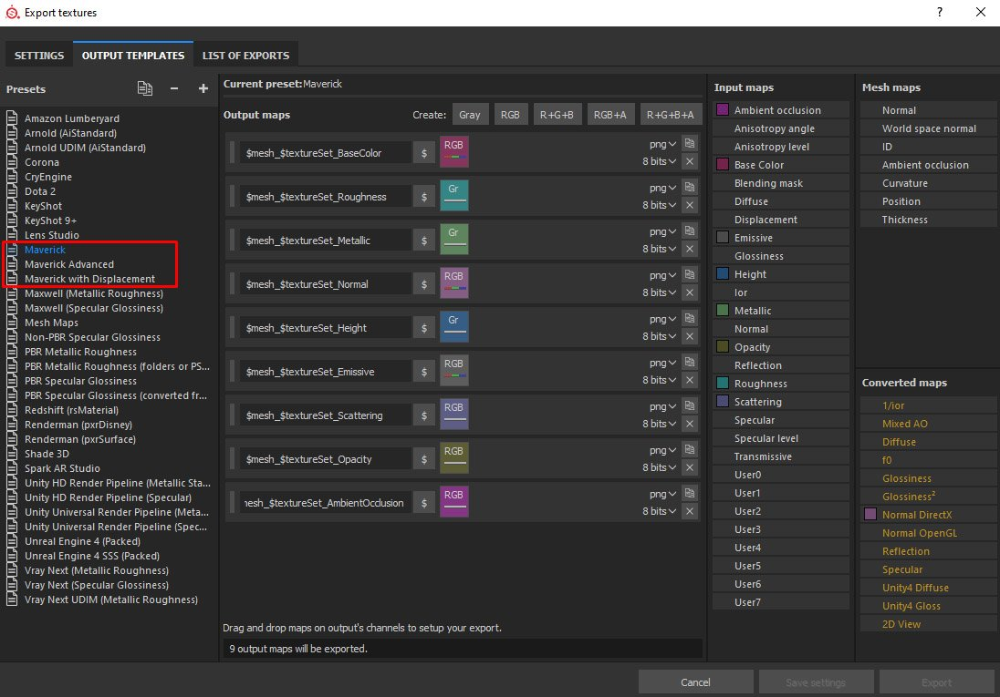

# Intégration des Substances Painter

>[!NOTE]
>
> **Informations**
> 
> Important : ajoutez nos paramètres prédéfinis au programme d’installation du Substance Painter.\
> Vous pouvez télécharger ces 3 paramètres prédéfinis ici :\
> <https://www.dropbox.com/s/11vuk0k0ob772mv/Maverick_Export_Pre>[sets.zip](https://www.dropbox.com/s/11vuk0k0ob772mv/Maverick_Export_Presets.zip)

Vous pouvez facilement importer votre projet de Substance Painter dans Maverick en procédant comme suit :

**Dans Substance** **Painter**&#x200B;**:**

1. Exportez votre filet.
1. Exportez vos textures dans le même dossier que le maillage, en utilisant l’un des paramètres prédéfinis Maverick (voir l’image) :

   

   *Choisissez* *«**Paramètre prédéfini**&#x200B;Maverick&#x200B;**» dans le* cas général &#x200B;** cas*.

   *Choisissez* *«**Maverick* *Avancé* *préréglage**» si* *vous avez&#x200B;**peint* *une* *carte &#x200B;** spécifique&#x200B;**telle* *que* *anisotropie* *ou* *revêtement**.*

   *Choisissez* *«**Maverick**&#x200B;avec **Displacement**&#x200B;préconfiguration&#x200B;**» si**&#x200B;votre* modèle *a une *carte **de displacement**&#x200B;pertinente*. Ce* *paramètre prédéfini&#x200B;**exportera* *l&#39;* *height &#x200B;** map&#x200B;**in**&#x200B;32 bits pour* *Maverick* *capturer toute la **géométrie** de haute **qualité**.*

   **In** **Maverick**&#x200B;**:**
1. Cliquez sur l’icône de Substance Painter :

   
1. Sélectionnez le fichier de maillage exporté depuis Substance Painter.
1. Suivez les instructions de la boîte de dialogue Importer :

   * Dans la première boîte de dialogue, vous pouvez définir certains paramètres de matière.
   * Dans la deuxième page de dialogue, vous pouvez choisir l’ambiance dans laquelle votre modèle apparaîtra.
   * Dans la troisième page de dialogue, vous pouvez choisir l’échelle et l’orientation de l’axe de votre modèle.

   
1. Continuez et vous obtiendrez votre modèle correctement organisé par ensemble de textures et avec ses matériaux automatiquement créés et appliqués. Tout est prêt pour la phase d&#39;éclairage.

   **Si** **vous &#x200B;**&#x200B;**modifiez**&#x200B;**vos** **textures dans Substance** **Painter**&#x200B;**, exportez** **les &#x200B;**&#x200B;**à nouveau**&#x200B;**,** **écrasez** **les** **précédentes &#x200B;**&#x200B;**celles**&#x200B;**.** **Ensuite**&#x200B;**, dans** **Maverick &#x200B;**&#x200B;**, utilisez l&#39;icône de mise à jour**&#x200B;Cartes&#x200B;**&#x200B;**&#x200B;**&#x200B;**&#x200B;**&#x200B; :**

   {width="800px"}

   Vous pouvez voir le processus complet dans le tutoriel vidéo suivant :

   [**https://youtu.be/vw2RPGjPhh8**](https://youtu.be/vw2RPGjPhh8)
