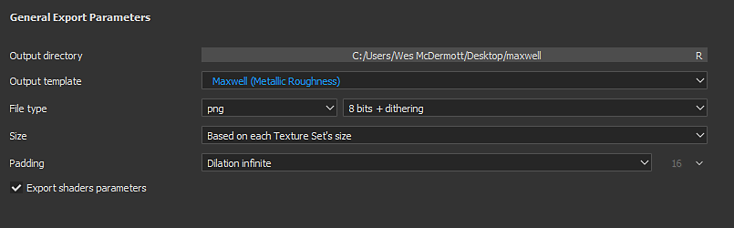

# Maxwell - Substance Painter

Substance Painter 2020.1 (6.1.0) prend en charge les [Modèles de sortie](https://experienceleague.adobe.com/fr/docs/substance-3d-painter/using/getting-started/export/export) Maxwell pour les propriétés Métallique/Rugosité et specular/Éclat. Vous pouvez simplement exporter à l’aide du Modèle de sortie Maxwell**.\
Maxwell 5.1.0** s’intègre à Substance Painter pour vous permettre d’importer facilement des textures et de configurer automatiquement un matériau Maxwell.

## Exportation de textures

Vous pouvez choisir les Modèles de sortie Maxwell (rugosité métallique) ou Maxwell (brillance Specular) pour exporter des textures en vue d’un rendu dans Maxwell.

{width="500px"}

## Application de textures dans Maxwell

Vous pouvez utiliser l&#39;intégration de Substance Painter dans Maxwell pour créer automatiquement un matériau avec les cartes exportées à partir de la Substance Painter appliquée.\
Pour commencer, cliquez avec le bouton droit de la souris dans la liste des matériaux et sélectionnez **Nouveau>Substance Painter**.

Accédez à l’emplacement où vous avez exporté les textures de Substance Painter et sélectionnez l’une des cartes comme couleur de base. Lorsque vous cliquez sur Ouvrir, l’intégration crée un nouveau matériau Maxwell avec les cartes attribuées.\
Si plusieurs ensembles de textures sont exportés à partir de Substance Painter, l’intégration utilise la convention de dénomination de la texture pour attribuer les textures correspondantes.

{width="600px"}

Vous pouvez ensuite attribuer la matière à la ressource dans votre scène.

{width="500px"}

Toutes les matières utilisées à l’aide de l’intégration de la Substance Painter.

{width="800px"}
