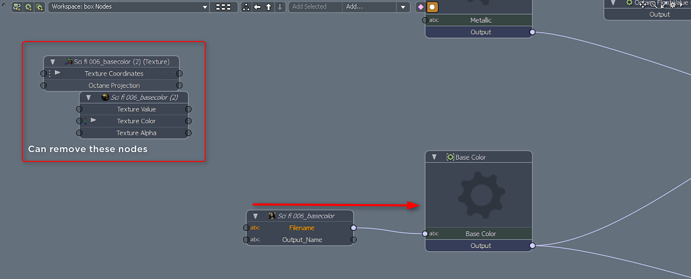

# Octane pour MODO

## Substance dans le plug-in MODO

Les sorties de Substance fonctionnent en mode natif avec Octane. Vous pouvez utiliser les configurations d’effets de calque et de sorties de Substance suivantes.

1. Créez une Substance > Texture > Créer une Substance et définissez le mode sur Matériau irréel. L’utilisation du matériau irréel vous permet d’afficher la texture dans le viewport OGL avancé.
1. Créez des sorties pour base color, métallique, rugosité et normal.
1. MODO utilise les Maps normal OGL. Dans les propriétés de la Substance, vous devez changer le sens normal en OpenGL.

   
1. Chargez le paramètre prédéfini PBR de la Substance. Ce paramètre prédéfini est un remplacement d’octane. Faites-le glisser dans votre groupe shader.

   [Substance\_PBR.lxp](https://helpx.adobe.com/content/dam/help/en/substance-3d/documentation/integrations/files/162005234/162005272/1/1502792782697/substance-pbr.lxp)
1. Sélectionnez le remplacement et faites glisser les sorties de Substance de l’Explorateur d’éléments dans la vue Schéma. Prenez le nœud avec le nom de fichier et connectez-le au Noeud d&#39;entrée approprié, c&#39;est-à-dire base color → base color.

   
1. Connectez les autres sorties de Substance

   {width="640px"}
