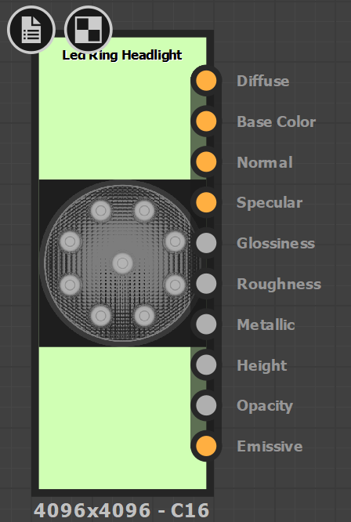

# Moteurs de rendu

Les matériaux de Substance fournis dans [Substance Source](https://source.substance3d.com/) contiennent des sorties pour les ombrages basés physiquement et prennent en charge les [workflows Métallique/Rugosité (workflow par défaut) et Specular/Brillance](https://academy.substance3d.com/courses/pbrguides). Il est important de comprendre le workflow pris en charge par votre matériau de rendu. Selon le système de rendu, vous pouvez être en mesure d’utiliser directement les sorties de matériau de Substance ou vous devrez peut-être convertir les textures de sortie. Les matériaux de Substance personnalisés ou téléchargés depuis Substance share peuvent ne pas contenir les sorties appropriées requises pour un moteur de rendu donné.

{width="200px"}

Par exemple, avec Arnold ou Vray Next, vous pouvez utiliser directement des sorties métalliques/de rugosité. Cependant, avec la PxrSurface de Renderman, les sorties couleur de base/métallisées doivent être converties en couleur de face diffuse et specular. Un plug-in d’intégration de Substance de données gère automatiquement ces conversions si le rendu est pris en charge.

Avec la Substance Painter, vous pouvez choisir un [Modèle de sortie](https://experienceleague.adobe.com/en/docs/substance-3d-painter/using/getting-started/export/export-window/export-window) qui créera les types de mappage appropriés nécessaires pour un moteur de rendu donné. Si le rendu n’est pas pris en charge par défaut, vous pouvez également créer des Modèles de sortie personnalisés.

**Modèle de sortie de Substance Painter**

{width="500px"}

## Repères de rendu

* [Conversion de sorties de Substance](../renderers/converting-outputs/converting-substance-outputs.md)
* [Gestion des couleurs](../renderers/color-management/color-management.md)
* [Arnold](../renderers/arnold/arnold.md)
* [Vray](../renderers/vray/vray.md)
* [Renderman](../renderers/renderman/renderman.md)
* [Redshift](../renderers/redshift/redshift.md)
* [Maxwell](../renderers/maxwell/maxwell.md)
* [Corona](../renderers/corona/corona.md)
* [Octane](../renderers/octane/octane.md)
* [Keyshot](../renderers/keyshot/keyshot.md)
* [Thea](../renderers/thea/thea.md)
* [franc-tireur](../renderers/maverick/maverick.md)
* [Toolbag](../renderers/toolbag/toolbag.md)
* [Cycles et yeux](../renderers/cycles-and-eevee/cycles-and-eevee.md)
