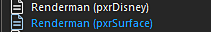

# Renderman - Substance Painter

Substance Painter 2020.1 (6.1.0) prend en charge [**pxrSurface**](https://rmanwiki.pixar.com/display/REN/PxrSurface) et pxrDisney [Modèles de sortie](https://docs.substance3d.com/display/SPDOC/Export).

Il est recommandé d&#39;utiliser **pxrSurface** pour la sortie.

## Renderman Shader (Maya - RM 23.1)

| Exportation de Substance Painter | PxrSurface |
| --- | --- |
| DiffuseColor | Diffus/Couleur |
| RugositéSpéculaire | Specular primaire / Rugosité |
| SpecularFaceColor | Couleur primaire du Specular/du visage |
| Normale | Globals / Bump / PxrNormalMap → Orientation (Open GL) |
| Displacement | (canal rouge ) PxrDispTransform (Result F) → (disp scalar) PxrDisplace (Out Color) → (Displacement Shader) PxrSurfaceSG |
| GlowColor | Lueur / Couleur (Gain = 1,0) |
| Présence | Globals / Présence |

>[!NOTE]
>
> Les cartes qui représentent des données devront être interprétées correctement. Pour plus d&#39;informations, consultez la page [Gestion des couleurs](../../../renderers/color-management/color-management.md).
